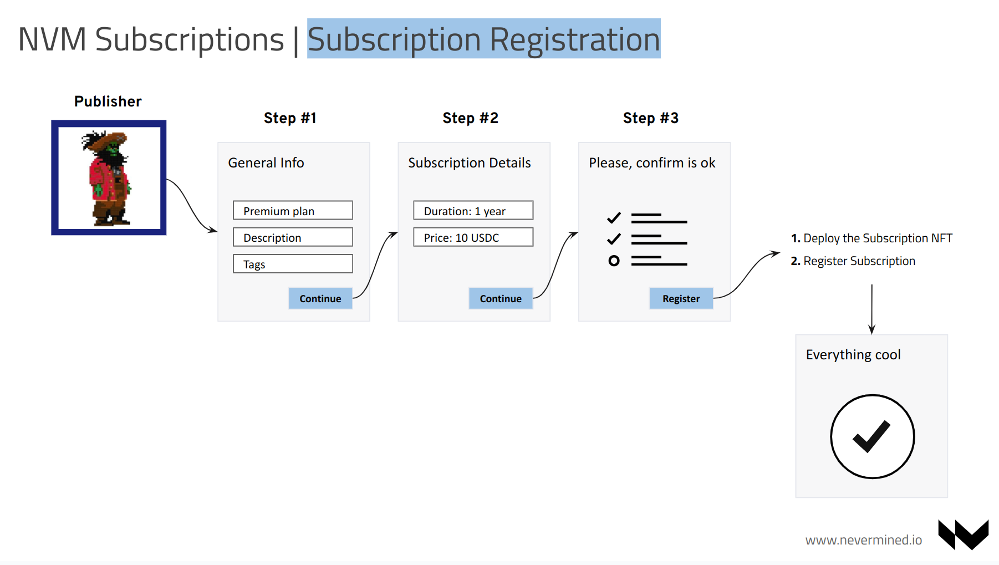
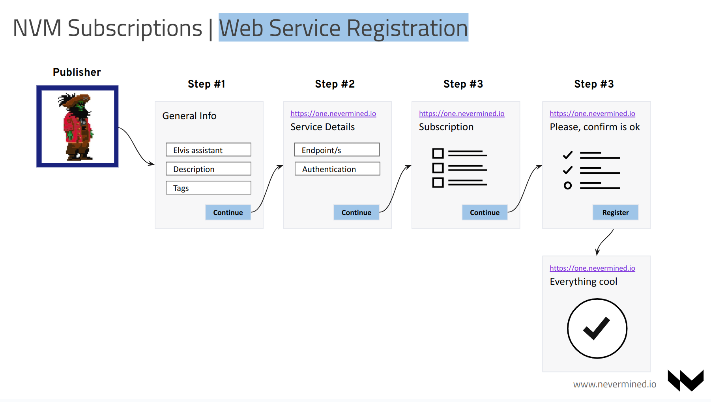
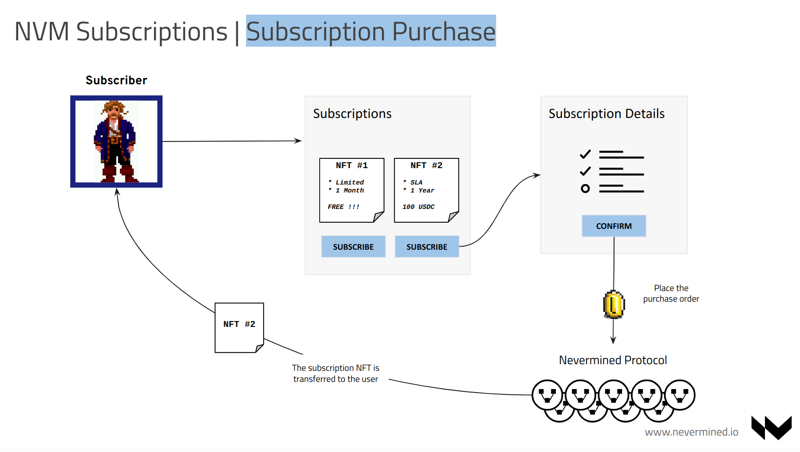
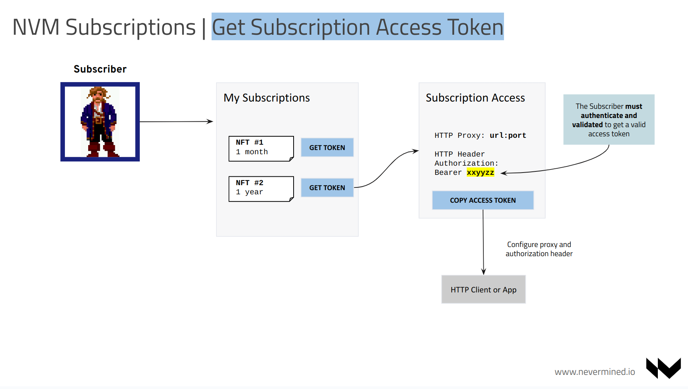
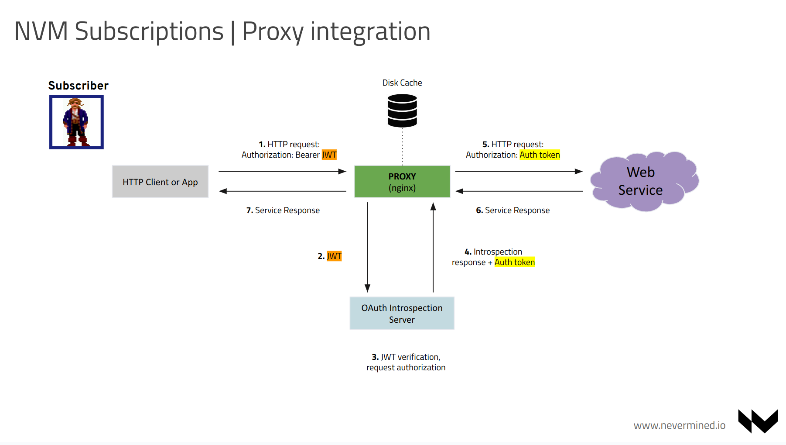

# How everything works

## End to end flows

Let’s unpack this for 2 different personas, the Publishers of the web service and the Users. 

### The Publishers

The Publishers just need to:

1. Define one or more subscription tiers. This includes a basic description about the service, the duration of the subscription (e.g. one year.) — the price of the subscription (e.g. 10 USDC.)
2. Register your AI’s web service endpoints and the service authentication. Once that’s done, you simply link it to the subscription(s) that you created in step 1.

The resulting Subscription NFT is your Nevermined asset with an associated NFT Smart Contract owned by the publisher. The web service is also registered as your Nevermined asset and defines conditions that restrict access to only those holders of the applicable NFT (i.e. your Subscription NFT).

When the Publisher provides information about the service, in many occasions these web services are protected to avoid everyone accessing them. Nevermined enables end-point service protection via its tool that encrypts the relevant access information available only to certain node(s) of the network trusted by the Publisher (note that trust can be revoked at any time.).

### The Users

From the User side, the process is simple. After reviewing the details of a web service via the metadata provided by the Publisher, the User can purchase the subscription from the Publisher and get access to the associated service. In doing so, the user will own an NFT that provides access to the web service.

Now that the Subscriber owns a Subscription NFT, they can access the associated service(s) via a unique access token (JWT). This token identifies the User as a subscriber and allows them to send HTTP requests to the web service through any of the Nevermined proxies trusted by the Publisher.

Everything here is standard HTTP. A Subscriber who has a JWT access token can make requests with any standard HTTP client or library.

Under the hood, this work as follows:

1. The Subscriber gets a JWT access token.
2. The Subscriber configures the JWT access token in a HTTP client or library to communicate with any of the trusted proxies of the Subscription NFT.
3. The Subscriber, via the HTTP client, sends a secure request to the web service through the proxy attaching the JWT access token.
4. The proxy checks the access token and authorizes the User.
5. If the User is authorized, based on the conditions of the Subscription NFT, the proxy composes a valid request to the upstream web service, including the upstream. authorization token (different to the JWT and never released to the User)
6. The web service authorizes the request and returns the result of the web service call through the proxy.

The User who purchased the Subscription NFT now has access to a web service only available to the holders of the NFT subscription.

Some of the secret sauce here (but not so secret because it is Open Source) comes from the Nevermined Proxy. This component can be run by anyone, allowing the existence of networks of Proxies trusted (or not) by the Publishers and Users. 
Enter decentralized superpowers for the win!

