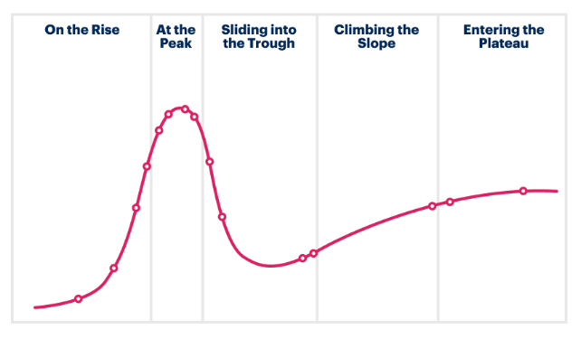

# Bringing NFTs to a new Dimension

## What's a NFT

NFTs represent ownership of digital assets in a decentralized manner. They allow that assets you own in a digital environment belong to you and not to a third-party.
In digital environments where assets don't live in a physical world, the ownership of them is more faith than a reality. Faith in infrastructure where these assets live, and faith in the owners of that infrastructure.

It's quite common to think you own that character you purchased to play a video game, that subscription to a streaming service, etc. But in reality these are just entries in a company database. These assets you "own" and probably you paid for, tomorrow can be updated or deleted (accidentally or not) by the entity running the infrastructure where these digital assets exist, your account can be "banned", etc. In any of these situations all your digital assets just evaporate. And good luck claiming for them.

NFTs are good to remove that dependency on any third-party. They live in a blockchain not owned by anyone directly, and their code (the NFT Smart Contract code) who owns them and what can be done with them and what not. Something so "simple" has massive implications because it gravitates the "real ownership" and responsibility of the asset to the final user.

### New generation of NFTs

As any new technology, in the short history of NFTs they went through the typical journey of the emerging technology hype cycle.

During 2021 and 2022 we lived the infancy of the NFTs technology. Many digital assets were put online and traded. With a bigger focus in the speculative factor of the new thing, the first age of NFTs had some characteristics:

* The concept of ownership was not enforced, the NFT content creator didn't "own" the asset but a small
* From a users point of view, most of the NFTs didn't represent any real benefit vs traditional assets. Terms & conditions made that very clear.
* No attribution, no provenance, no utility, just static pictures

Beyond the fun of playing with a new technology, the first age of NFTs didn't provide any real value to content creators or users. There is an obvious disenchantment because they didn't provide any real improvement.

But with the lower hype came also more clarity and thinking on the benefits NFTs technology can bring to a digital world and their users. A second age of NFTs is coming with a different direction:

* Enforcement of ownership and content attribution to creators and users
* Activation of digital assets utility
* Remix/combination/interaction of NFTs
* Attribution to content creators, provenance and royalties for secondary market sales

More information in the post: [Facilitating asset tokenization with NFTs](https://medium.com/nevermined-io/facilitating-asset-tokenization-with-nfts-3f725bfd51e2).

### Utility

In a digital world assets need to be represented somehow. We spoke about the ownership of them. But also NFTs are useful to describe the digital asset, what are their properties and how that asset can be used. This is important because on top of the "ownership" concept we can build the "utility" concept. That means how the asset can be used and under what conditions.

The utility allows that asset owners can define things like:

* A piece of that asset can be sold
* That ownership from a third-party of a piece of an asset can give access to something exclusive
* That asset can be rented for being used
* Or lended
* etc, etc

There is a big territory to explore where content owners and developers can design and activate different kinds of utilities on this new kind of digital assets.

### ERC-721 vs ERC-1155

There are many different standards in different states defining NFTs and their potential characteristics. But the 2 main standards are:

* The [ERC-721](https://ethereum.org/en/developers/docs/standards/tokens/erc-721/) for Non-Fungible NFTs. This allow to tokenize digital assets in several pieces. And each piece is unique. An anology in the physical world would be a photography. An artist could cut the original negative in 10 pieces and sell to the collectors. Each piece is unique and different to the others.
* The [ERC-1155](https://ethereum.org/en/developers/docs/standards/tokens/erc-1155/) describes the Multi-Token standard. It allows to tokenize assets where each piece is not distinguble of the others. An anology would be the money. If dollars can be represented via a NFT ERC-1155 because my dollar is not distingueable of your dollar.

Each of these standards are usful and fit better depending on the use case. 

## What extras are provided by Nevermined NFTs?

In Nevermined [we built](https://github.com/nevermined-io/contracts/tree/master/contracts/token) some additional features on top of both standards that can be used to deliver more powerful use cases.
Some of these extra features are the following:

### Selling and Purchasing assets

Via the Nevermined Service Execution Agreements, content creators and their users can trade around digital assets in a decentralized manner. This means content creators can define under what conditions they want to sell their NFTs, and users can purchase them. The Nevermined Smart Contracts work as an intermediary of that process and ensure this process is executed securely for all the parties.

### Access Control

Nevermined includes an access control piece that allows content creators to provide special access to certain assets or services under some circumstances. This enables powerful use cases like exclusive access, enabling the users holding some NFTs to get access to something exclusive and unique.

### Royalties and Secondary Markets

When content creators sell NFTs associated with their creations they lose control of who owns what. Nevermined enforces royalties in sales in secondary markets, allowing content creators to define upfront the royalties they want to receive, and collect them if there is a secondary market sale.

### Search and Discovery

To facilitate the discovery of digital assets and the NFTs attached to them when assets are registered into Nevermined the creator can define some metadata. This metadata can be stored in an immutable manner too on IPFS or Filecoin.

### Provenance

Nevermined Smart Contracts provide a provenance track record that register all the interactions around digital assets. More information in this [Provenance blog post](https://medium.com/nevermined-io/provenance-everything-has-a-story-behind-1275e3693d3f).

### Subscriptions

Nevermined allows content creators to control the access to exclusive stuff to users who are subscribed. These subscriptions can be defined in a flexible manner and specify a duration. More information in this post: [Bringing online subscriptions into Web3 with NFTs](https://medium.com/nevermined-io/bringing-online-subscriptions-into-web3-with-nfts-5fc2e9570122).
