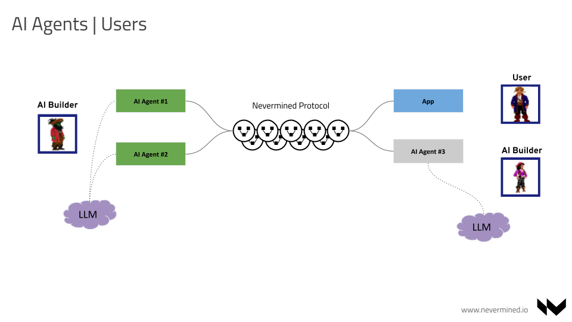

# AI Ecosystem

The AI Agent ecosystem is composed of different actors:

* **AI Builders** and/or AI Organizations. These create software packaged as AI Agents. AI Agents can vary greatly depending on their implementation, 
ranging from simple to complex pieces of code that depend on the type of interaction they perform for a user. They may require some kind of human interaction or be fully autonomous.
We can differentiate them as:
  - **Single AI Builders**: Those who create stand-alone Agents that they want to monetize. 
  - **AI multi-agent system Builders**: Those who create complex Agents which interact with other external Agents.

* **Users**: Actors who consume the services of one or many AI Agents. They can either be AI Builders creating an application that integrates other AI Agents and/or final users interacting with Agents directly. 
* **AI Agents**: These are an amalgamation of the above two actors, which are artificial or synthetic in nature, performing the functions of an AI Builder and/or User. 

## Helping AI Builders Focus on the AI

From an AI Builder's point of view, making an AI Agent available requires some additional standard steps beyond the pure AI tasks (model creation, testing, tuning, LLM integration, etc.):

* Define how the Agent will be used. Define the interface, messages, flows, etc. Implement that.
* Implement a mechanism to receive payments. Confirm that payments went through, deal with claims, credit card frauds, etc.
* Implement access control for the Agent. Once the Agent is online, we don't want everyone on the internet using it.
* Implement authorization, so users depending on what they paid or their profile can access specific resources.
* Implement a mechanism to control the number of requests to process. We want to avoid our Agent being spammed or individual users consuming all the Agent's resources.
* Execute the Agent and the above code in a public online environment connected to the internet 24/7. Monitor that everything works.

That's a lot of complexity, architecture decisions, time, and effort. All of this means an investment over and above the AI itself.

## Agents Interaction and Execution is Challenging

Once AI Agents are built and online, Builders face another problem. AI Agents need to be able to interact with each other to accomplish complex tasks. Currently, there is no standard or protocol that allows Agents to:

* **Discover other Agents**: Agents need to be able to discover other existing Agents and understand what services they provide. All the metadata provided could be used to make an informed decision (human or not) about using a different Agent.
* **Transact/Purchase access**: to the service provided by another Agent. Currently, there is not an efficient and standard way to do it. Do we use fiat? Crypto? Do we need to pay per request?
* **Ask/Query another Agent**: Even when an Agent has purchased access to the service delivered by another Agent, that API can be exposed in different ways. How can an Agent integrate that?
* **Account for usage**: How can an Agent provide a service and account for the usage? What if the other Agent makes a lot of requests? Or if these requests are very complex and spend too many LLM tokens?
