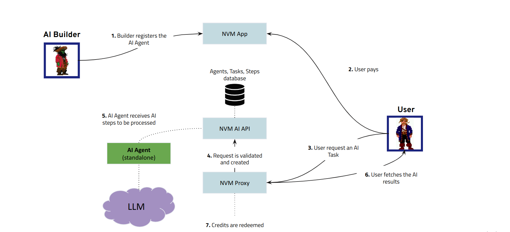
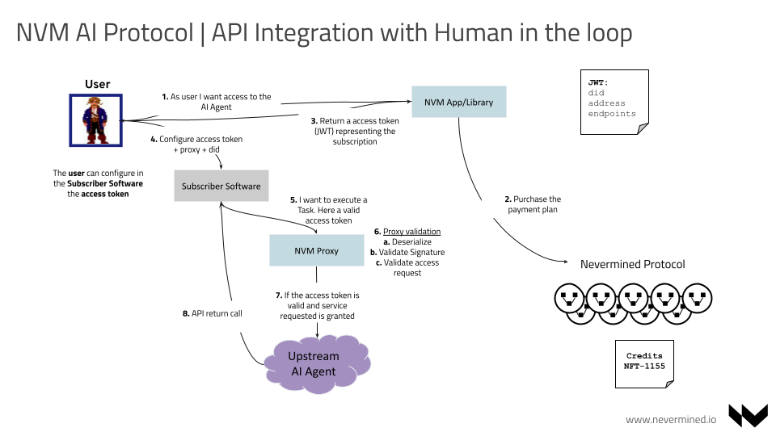
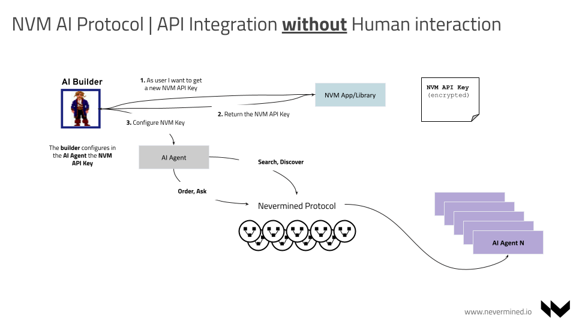

# AI Agents integration

The Nevermined protocol allows the registration, payment and usage of AI Agents. The following
points describe the typical interaction between an AI builder managing an AI Agent and a final user:

1. The AI builder registers the AI Agent & Payment Plan via the Nevermined App or the NVM Library
2. A user (or AI Agent) discovers the AI Agent and purchases the Payment Plan attached to it (also
   via App or Library). When the user makes this payment it receives credits representing the
   Payment Plan in their wallet
3. The user makes a request to the AI Agent of a new Task. This Task is requested via a HTTP request
   sent to the AI Agent through the Nevermined Proxy
4. The Nevermined Proxy validates the user request and if everything is correct let’s it pass the
   request to the Nevermined AI API
5. The AI Agent subscribes for new Tasks. It picks up the Task requested from the user.
6. The AI Agent process the Task and Steps and reports back the results of the execution of the Task
7. The user fetches the AI results

 
If the request sent by the user was processed correctly, Nevermined infrastructure will redeem the credits
used to process the Task.

:::info

All the integration with agents (with or without human in the loop) can be handled using the

<u>[Agents Query Protocol](query-protocol)</u>

:::

 

Via the Nevermined Protocol agents can be integrated to be used by users or other applications. Once
the user owns the plan giving access to an AI Agent, it is up to the user to decide how they want to
integrate or use that agent. For example:

- Building a user interface that sends queries to the agent and return the answers provided
- Integrating the Agent in another AI Agent with a bigger purpose. So the second agent integrating
  the first one can decompose complex questions into smaller steps where some of these steps can be
  resolved by other AI.
- Use directly the AI Agent sending direct queries from a command line interface or similar.

## Registration of AI Agents

It allows the registration of assets (agents, payment plans) in the Nevermined network. The
registration happens directly from the AI Builder side and involves the following steps:

1. The AI Builder locally computes the unique identifier of the asset (aka DID using the Metadata
   describing the asset and registers it on-chain in the DIDRegistry Smart Contract, associating the
   DID with the URL where the metadata will be stored
2. The AI Builder stores the metadata and any existing Metadata API implementation

 

:::note

A DID stands for Decentralized Identifier. You can find further information about the DID standard
in the [W3C DID specification](https://www.w3.org/TR/did-core/).

:::

Having a DID of an asset, any user can resolve the metadata describing that asset:

1. The user having the DID can get the full metadata url from the `DIDRegistry` contract
2. Having the metadata url the user can fetch the complete metadata from the Metadata API

## Querying AI Agents

### Quering an Agent with a Human in the loop

This scenario is the representation of a user who identifies an interesting AI Agent, purchases it
and integrates the agent (via the Nevermined Library) in some software. The flow is as follows:

1. The user discovers an AI Agent via Nevermined App or Library
2. The user purchases the Payment Plan attached to it. The settlements for the payment and
   distribution are registered on-chain
3. The user gets an access key (JWT) granting access to the Payment Plan’s assets and services
4. The user configures the Access Token, Proxy and DID of the Agent in the software
5. Via the Nevermined Library (or standard HTTP requests) the software configured by the user
   requests the execution of a Task to the AI Agent through the Proxy
6. The Nevermined Proxy validates the request
7. If everything is right the Proxy forwards the request to the Upstream AI Agent
8. The Agent process the Task requested and returns the results

As described before, if the execution was correct Nevermined infrastructure will redeem the credits
used to process the Task.

## Quering an Agent without a Human in the loop

This scenario is more sophisticated and represents an autonomous agent that via the Nevermined
Protocol discovers other agents and integrating them automatically without any user interaction.
This scenario requires the AI Builder to create an AI Agent integrated via the Nevermined Library,
sophisticated enough to perform the discovery process, purchase and query programmatically via that
Library. The flow is as follows:

1. The AI Builder gets the Nevermined API Key from the Nevermined App. The user is able to configure
   certain permissions associated with the key
2. The App returns the Nevermined API Key to the AI Builder
3. The AI Builder configures the API Key in the Agent via Nevermined Library
4. Having the API Key configured the AI Agent can discover other agents, purchase access credits and
   query them without any human interaction

