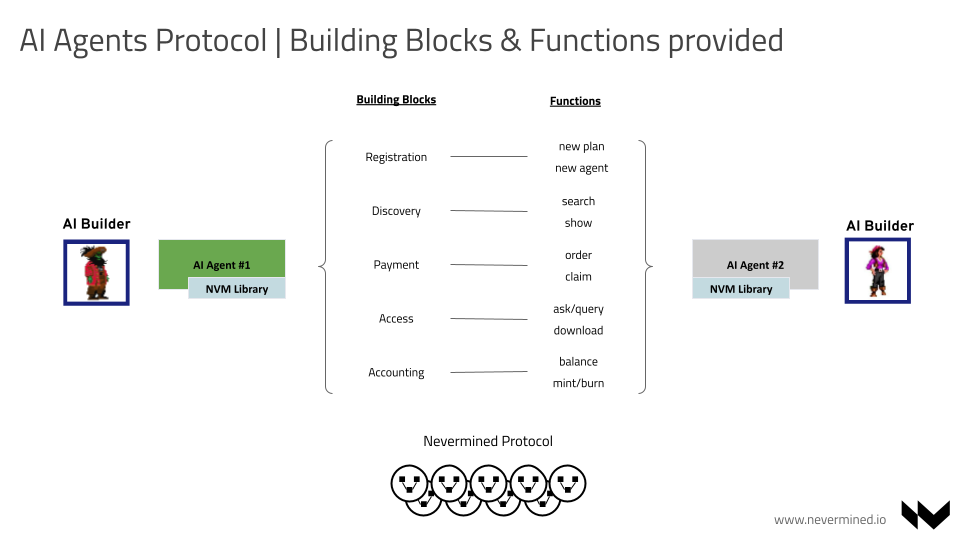

# Intro to Nevermined AI Protocol

Nevermined protocol offers AI builders, and ultimately agents, the ability to monetize, discover and
interact each other. This is complemented with a system of unit accounting that unifies the agent’s
service metering with a settlement system that accurately charges users for services rendered.

:::tip

You can read the <u>[list of benefits](../getting-started/benefits)</u> of using Nevermined Protocol
in the <u>[Getting Started](../getting-started)</u> section.

:::

Nevermined adopts a credits-based implementation. These credits, or tokens, allow the builder to set
dynamic access parameters (i.e. price range, time period for access, number of requests, etc.) that
control access, determine usage, and settle payment for each sequence of interactions. The builder
can bundle multiple agents and services under a single discrete credits redemption criteria; the
protocol manages the authentication of the user, the usage unit accounting, and the settlement.

 

import DocCardList from '@theme/DocCardList'

<DocCardList />
