# How to add funds to your MetaMask wallet

Nevermined is live on 3 networks: [Polygon](https://matic.nevermined.app), [Gnosis](https://gnosis.nevermined.app) and [Arbitrum](https://arbitrum.nevermined.app). 

Below we will outline the steps you need to take to get tokens for these networks. 
If you want to get tokens for the respective testnets, please go to [this tutorial](50-faucets.md), on getting tokens from faucets. 

## How to get MATIC and USDC for Polygon

* To buy a Smart Subscription for an asset you need MATIC to pay for the network transaction fee and you need USDC to pay for the assets you're purchasing. 
* To publish a Smart Subscription (and the associated AI web service or Data) you only need MATIC, to pay for the network transaction fees. 
You will receive USDC when someone buys access to your asset. 

As often, these things change, so do your own research. And if you have any questions, join our Discord. 

### Scenario 1: Buy MATIC on MetaMask

Depending on where you live, you may be able to purchase MATIC directly on MetaMask using a credit card or debit card. 
Please note that this method can incur additional fees, and you might not receive the MATIC immediately, as transactions can take time to complete. 

Make sure you are connected to the Polygon main network. 

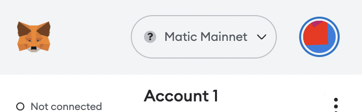

#### Step 1: Open the Metamask wallet browser extension

On the first screen, you will find four buttons under your wallet balance: Buy, Send, Swap and Bridge.

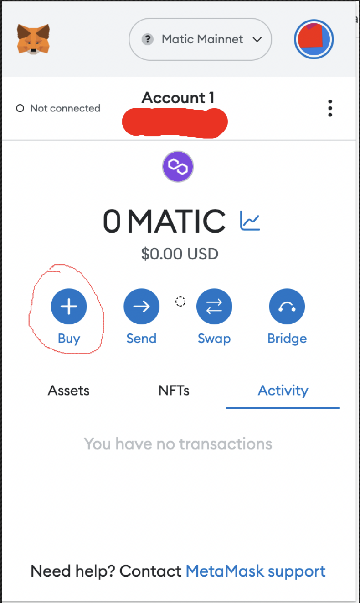

#### Step 2: Click Buy

#### Step 3: Specify your country

You will be prompted to select your country. Based on this, MetaMask will offer different payment methods, like Credit/debit card, SEPA or a third-party service like MoonPay or Transak.

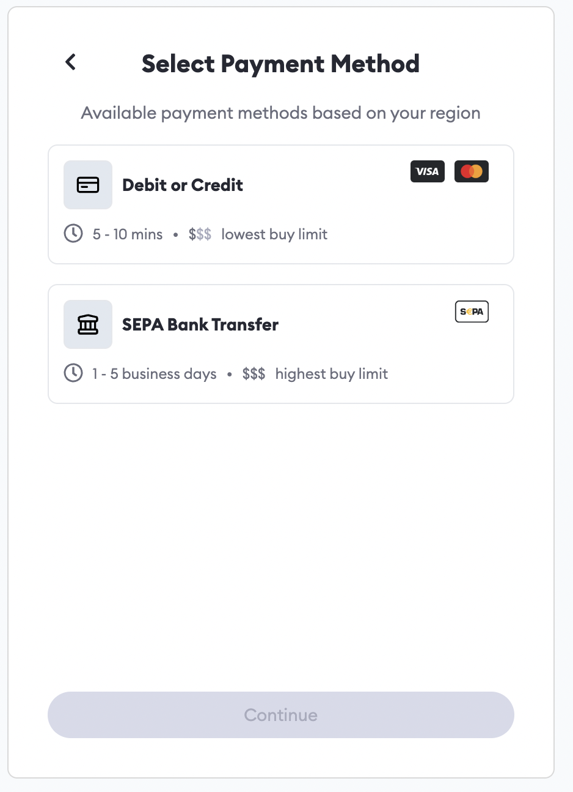

#### Step 4: Follow the prompts given by the service

These generally include Know Your Customer (KYC) requirements and filling in your credit card information.

#### Step 5: You are done

Once you are done with the instructions, your funds should appear in your MetaMask wallet. It’s important to look carefully at the transaction terms when choosing a third-party service to fund your account. 

### Scenario 2: Transfer MATIC to your MetaMask wallet

You can fund your MetaMask wallet with MATIC you bought on an exchange or are holding in another wallet. 

MATIC can be bought on major exchanges such as Coinbase, Binance or Kraken. You can find a full list of exchanges [here](https://coinmarketcap.com/currencies/polygon/markets/).

Below are the steps you need to follow after you have purchased your MATIC on that exchange and want to transfer it to your MetaMask wallet. 

#### Step 1: Launch the Metamask browser extension and hover your mouse over the wallet address. This starts with 0x.

#### Step 2: Copy the address to your clipboard

#### Step 3: Go to your cryptocurrency exchange and follow the instructions on sending or withdrawing funds. 

- Paste your MetaMask wallet address in the “recipient address” field supplied by the exchange.
- Check the exchange's documentation on how to withdraw to the MATIC/Polygon network. Instructions may vary, 

The token transfer process may not be instant. After processing your transaction, the crypto exchange will provide a unique transaction number that you will use to check the status of your transaction. 
Once they have arrived, they will show up in the Assets tab of your MetaMask wallet. 

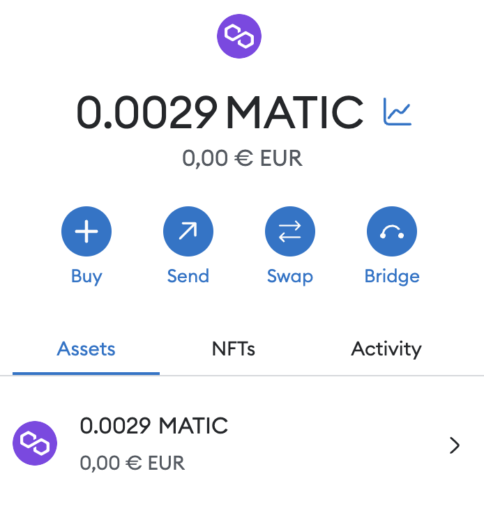

### Scenario 3: Get USDC for Polygon on MetaMask

#### Step 1: Open the Metamask wallet browser extension

If you're connected to Polygon, you will find four buttons under your wallet balance: Buy, Send, Swap and Bridge.

#### Step 2a: Swap option

Choose Swap to exchange some of your MATIC for USDC. Take note of transaction network fees and MetaMask fees. 

After confirming the Swap, USDC will show up in the Assets tab of your wallet. 

#### Step 2b: Bridge option

USDC is a token that is cross-chain compatible. This means it can be 'bridged' from one network to another. If you already have USDC on another network (e.g. Ethereum) you can use this option to get USDC on Polygon. 

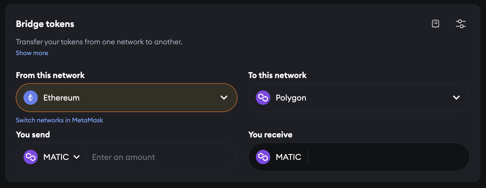

Note: there are other bridging services available, e.g. [https://wallet.polygon.technology/polygon/bridge](https://wallet.polygon.technology/polygon/bridge). 
Take good note of disclaimers and fees. 

### Scenario 4: Transfer USDC from an exchange

Some exchanges allow you to withdraw USDC directly to the Polygon network. 
If this feature is available, you can buy USDC on your favourite exchange and withdraw it to your MetaMask wallet. Make sure you read the exchange documentation and select the Polygon network when sending your USDC. 

## How to get xDAI and USDC for Gnosis

* To buy a Smart Subscription on Gnosis you need xDAI to pay for the network transaction fee and you need USDC to pay for the assets you're purchasing. 
* To publish a Smart Subscription (and the associated AI web service or Data), you only need xDAI, to pay for the network transaction fees. 
You will receive USDC when someone buys access to your asset. 

As often, these things change, so do your own research. And if you have any questions, join our Discord. 

### Scenario 1: Getting xDAI for network fees

This [StakingBits article](https://medium.com/stakingbits/setting-up-metamask-for-gnosis-chain-formerly-xdai-e0deb1541757) lists the following options: 

- From another user on the Gnosis Chain
- Converting DAI from Ethereum to xDai using the [xDAI Bridge](https://bridge.gnosischain.com/)
- Convert DAI from BSC to xDAI using the [OmniBridge](https://omni.xdaichain.com/)
- Purchase directly on [AscendEx](https://ascendex.com/en/global-digital-asset-platform) with the xDAI/USDT Pair
- Purchase directly with fiat using [Ramp.Network](https://ramp.network/buy/?swapAsset=XDAI)

### Scenario 2: Getting USDC for Gnosis

- Swap xDAI for USDC on a decentralised exchange like [Honeyswap](https://honeyswap.1hive.eth.limo//#/swap). 
- Bridge USDC from Ethereum or Binance Smart Chain, according to the instructions in [this tutorial](https://docs.gnosischain.com/bridges/tutorials/using-omnibridge/). 

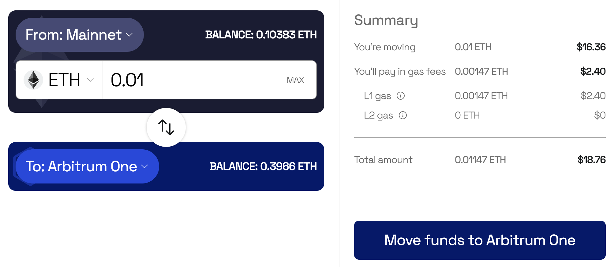

## How to get ETH and USDC for Arbitrum

* To buy a Smart Subscription on Arbitrum you need ETH to pay for the network transaction fee and you need USDC to pay for the assets you're purchasing. 
* To publish a Smart Subscription (and the associated AI web service or Data), you only need ETH, to pay for the network transaction fees. 
You will receive USDC when someone buys access to your asset. 

As often, these things change, so do your own research. And if you have any questions, join our Discord. 

### Scenario 1: Buy ETH on MetaMask

Depending on where you live, you may be able to purchase Arbitrum ETH directly on MetaMask using a credit card or debit card. 
Please note that this method can incur additional fees, and you might not receive the ETH immediately, as transactions can take time to complete. 

#### Step 1: Open the Metamask wallet browser extension

Make sure you are connected to the Arbitrum main network. If not, you may end up buying ETH for Ethereum, which you can't use (yet) on Nevermined. 

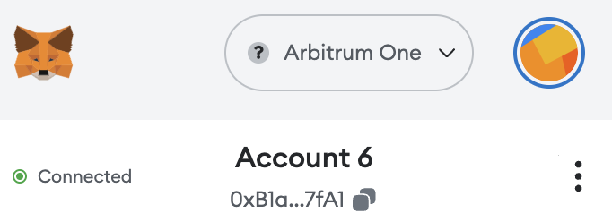

On the front page, you will find four buttons under your wallet balance: Buy, Send, Swap and Bridge.

#### Step 2: Click Buy

#### Step 3: Specify your country

Based on this, MetaMask will offer different payment methods, like Credit/debit card, Sepa or a third-party service like MoonPay or Transak to facilitate the transaction.

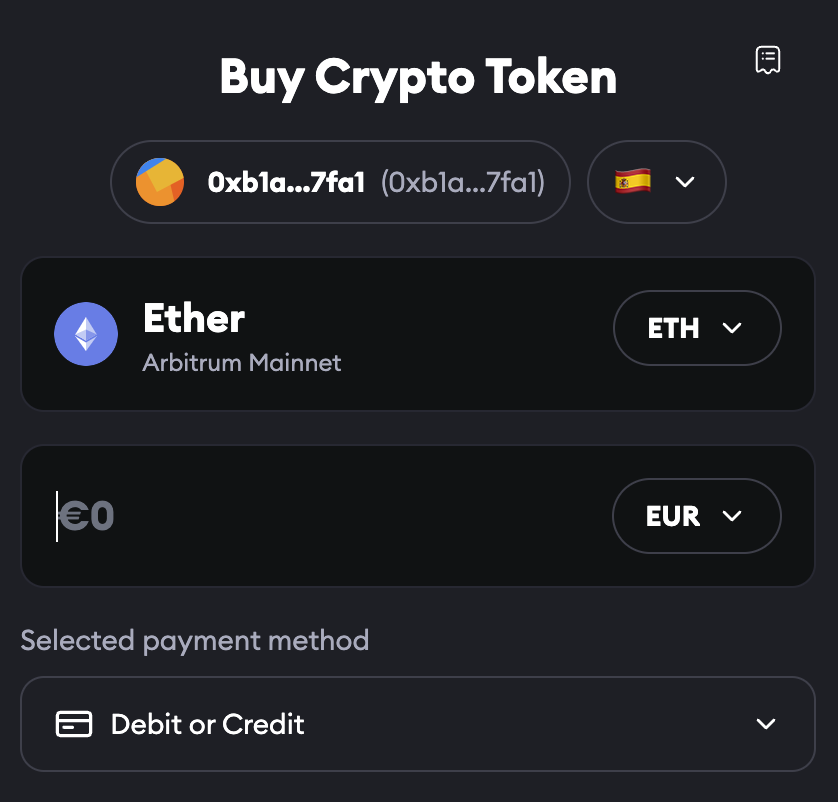

#### Step 4: Follow the prompts given by the service

These generally include Know Your Customer (KYC) requirements and filling in your credit card information.

#### Step 5: You are done

Once you are done with the instructions, your funds should appear in your MetaMask wallet. It’s important to look carefully at the transaction terms when choosing a third-party service to fund your account. 

### Scenario 2: Bridge ETH to Arbitrum 

If you have ETH on another network (like Ethereum), you can bridge it to make it available and usable on Arbitrum. 

You can use the Bridge function in your MetaMask wallet. 

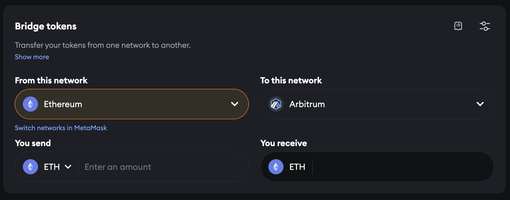

Note: there are other bridging services available, e.g. [https://bridge.arbitrum.io/](https://bridge.arbitrum.io/)
Take good note of disclaimers and fees. 

### Scenario 3: Buy USDC for Arbitrum on MetaMask

Depending on where you live, you may be able to purchase USDC (for Arbitrum) directly on MetaMask using a credit card or debit card. 
Please note that this method can incur additional fees, and you might not receive the USDC immediately, as transactions can take time to complete. 

#### Step 1: Open the Metamask wallet browser extension

Important!
- Make sure you are connected to the Arbitrum main network. If not, you may end up buying USDC for another network like Ethereum or Polygon. 

On the front page, you will find four buttons under your wallet balance: Buy, Send, Swap and Bridge.

#### Step 2: Click Buy

#### Step 3: Specify your country

You will be prompted to select your country. Based on this, MetaMask will offer different payment methods, like Credit/debit card, Sepa or a third-party service like MoonPay or Transak to facilitate the transaction.

#### Step 4: Select toke to Buy
In the top field, type USDC and Select the Arbitrum network from the dropdown. 
Important! Make sure you buy USDC, not USDC.e. 

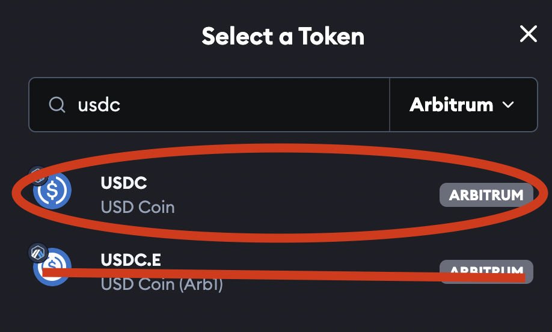

#### Step 5: Follow the prompts given by the service

These generally include Know Your Customer (KYC) requirements and filling in your credit card information.

#### Step 6: You are done

Once you are done with the instructions, your funds should appear in your MetaMask wallet. It’s important to look carefully at the transaction terms when choosing a third-party service to fund your account. 

### Scenario 2: Swap a token for Arbitrum USDC

If you already have a token on the Arbitrum network (e.g. ETH), you can swap it for USDC. 
In the MetaMask home screen, Choose Swap. Take note of transaction network fees and MetaMask fees. 

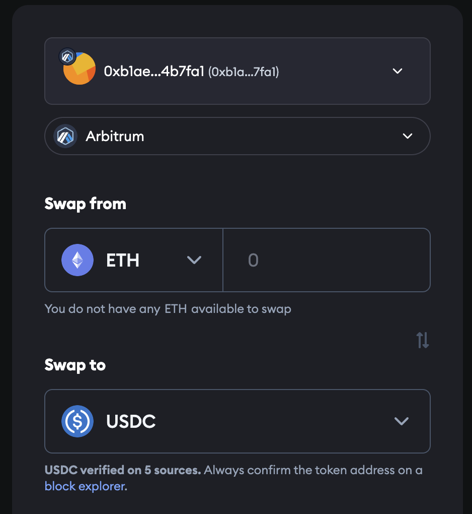

After confirming the Swap, USDC will show up in the Assets tab of your wallet. 

You can also use a decentralised exchange like Uniswap, SushiSwap or any of the other [dozens of exchanges that work on Arbitrum](https://www.alchemy.com/list-of/decentralized-exchanges-dexs-on-arbitrum) to swap a token (like ETH) for USDC. 

