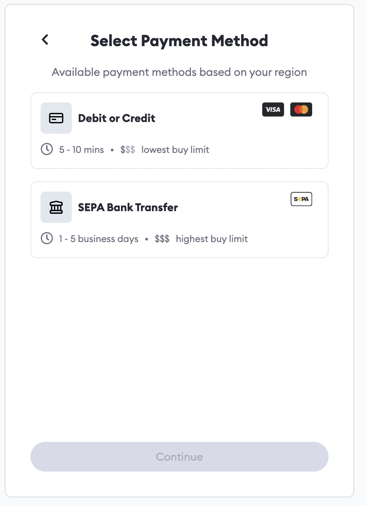

# How to use and configure Metamask wallet

MetaMask is a cryptocurrency wallet used to interact with the Ethereum blockchain. It can be accessed through an app or through a browser extension.
For the registration of assets and purchase of them Nevermined App registers all the transactions in a blockchain. So to make full usage of the app
you need to install and configure a Web3 wallet in your browser. 

In this tutorial we show how to use Metamask for that purpose:

## How to connect your wallet/Metamask

### Step 1: Download MetaMask wallet

Go to [Metamask Website](https://metamask.io/) and click on “Download”. Choose your preferred browser or mobile application and install the MetaMask extension.
MetaMask supports iOS, Android native apps along with Chrome, Firefox, Brave and Edge browser extensions.


### Step 2: Create a new MetaMask wallet

Click on “Create a Wallet” and on the next window click on “I agree” if you would like to help improve MetaMask or click on “No Thanks” to proceed.


### Step 3: Create a strong password for your wallet


### Step 4: Securely store the seed phrase for your wallet

Click on “Click here to reveal secret words” to show the seed phrase.


:::tip
MetaMask requires that you store your seed phrase in a safe place. It is the only way to recover your funds should your device crash or your browser reset. We recommend you write it down. The most common method is to write your 12-word phrase on a piece of paper and store it safely in a place where only you have access. Note: if you lose your seed phrase, MetaMask can’t help you recover your wallet and your funds will be lost forever.
:::


:::caution
Never share your seed phrase or your private key to anyone or any site, unless you want them to have full control over your funds.
:::

Click on next

### Step 5: Seed phrase confirmation

Confirm your secret backup phrase by performing the action prompted by MetaMask, i.e to write down a few of the words missing, in the order in which the words were presented on the previous screen. Click on “Confirm” to proceed.

Congratulations! Your MetaMask wallet has been set up successfully.


You can now access your wallet by clicking on the MetaMask icon at the top-right-end corner of your preferred browser.


## How To Use the MATIC and MUMBAI Networks With MetaMask

### Step 1: Download MetaMask wallet

To start, go to your extension menu in your browser, click on the Metamask icon and login to your MetaMask wallet. Click the wheel in the top right corner, from the drop down menu select "Settings".


### Step 2: Add the MUMBAI (TESTING) network

Scroll down and locate the Networks tab. Scroll to the bottom and click on the blue "Add Network" button.


Fill in the required fields to add the MUMBAI network to your wallet. For the most up to date list of Mumbai RPC's visit Polygon here.

```
Network Name: MUMBAI Testnet
New RPC URL: https://matic-mumbai.chainstacklabs.com
ChainID: 80001
Currency Symbol: MATIC
Block Explorer URL: https://mumbai.polygonscan.com/
```

### Step 3: Add the MATIC (PRODUCTION) network

Repeate the same steps to add the MATIC network. Fill in the required fields and make sure you enter information for the MATIC Mainnet!
For the most up to date list of Mainnet RPC's visit Polygon here.

```
Network Name: MATIC Mainnet
New RPC URL: https://rpc-mainnet.maticvigil.com/
ChainID: 137
Currency Symbol: MATIC
Block Explorer URL: https://explorer.matic.network/
```

## How do I add funds to my MetaMask wallet?

You can buy Matic directly on Metamask or transfer funds from a crypto exchange.
Depending on where you live, you may be able to purchase Matic directly on Metamask using a credit card or debit card. Please note that this method can incur additional fees, and you might not receive the Matic immediately, as transactions can take time to complete. 

### To buy Matic on Metamask on a Testnet

Please read the [Tutorial for getting tokens from faucets in testing environments](10-faucets.md).

### To buy Matic on Metamask

In case you’ve not added the Polygon Network to MetaMask, you need to add it to buy and store MATIC inside MetaMask. Make sure your set network is Polygon!


### Step 1: Open the Metamask wallet browser extension

On the front page, you will find three buttons under your wallet balance: Buy, Send, and Swap.


### Step 2: Click Buy

### Step 3: Specify your country

You will be prompted to select your country. Based on this, MetaMask will offer different payment methods, like Credit/debit card, Sepa or a third-party service like MoonPay or Transak to facilitate the transaction.




### Step 4: Follow the prompts given by the service

These generally include Know Your Customer (KYC) requirements and filling in your credit card information.

### Step 5: You are done

Once you are done with the instructions, your funds should appear in your Metamask wallet. It’s important to look carefully at the transaction terms when choosing a third-party service to fund your account. 


## Add Funds From a Cryptocurrency Exchange

You can fund your Metamask wallet with cryptocurrency by making a deposit from a reputable exchange such as Coinbase, Binance or Kraken. 

### Step 1: Launch the Metamask browser extension and hover your mouse over the wallet address

### Step 2: Copy the address to your clipboard


### Step 3: Go to your cryptocurrency exchange and follow the instructions on sending funds


### Step 4: Paste the Metamask address in the “recipient address” field supplied by the crypto exchange

The token transfer process may not be instant. After processing your transaction, the crypto exchange will provide a unique transaction number that you will use to check the status of your transaction. You can use this number to monitor the progress of your transaction on platforms like [Etherscan](https://etherscan.io/).
