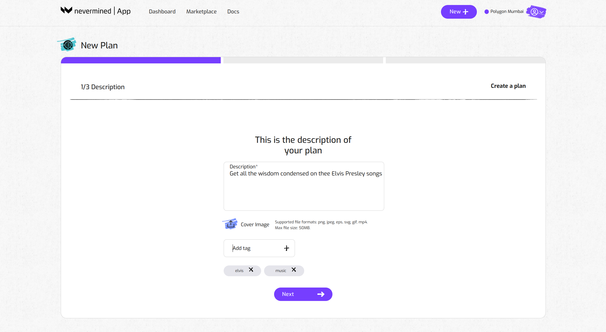
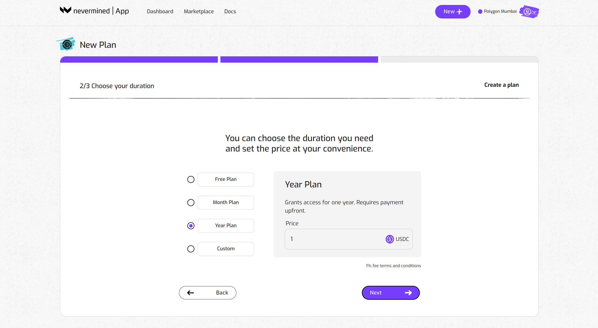
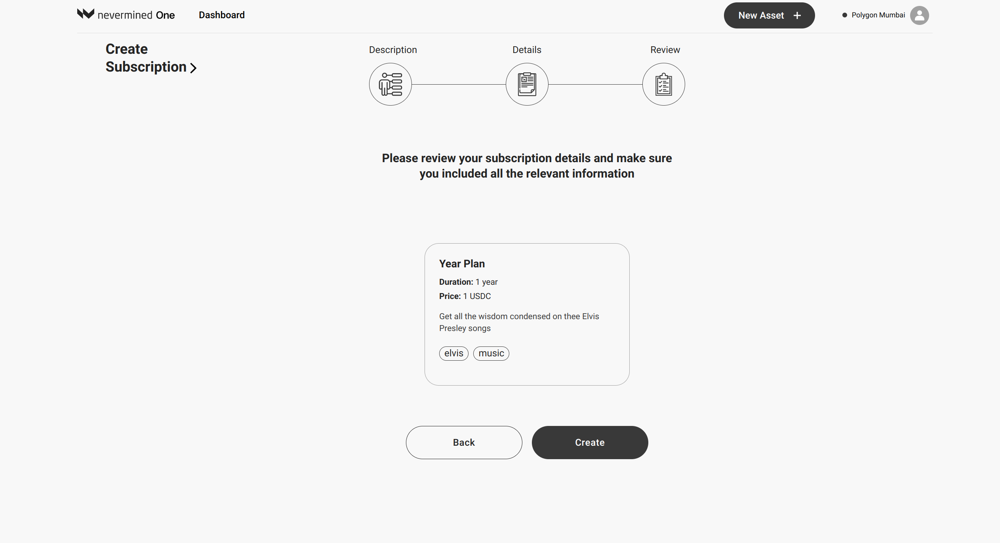
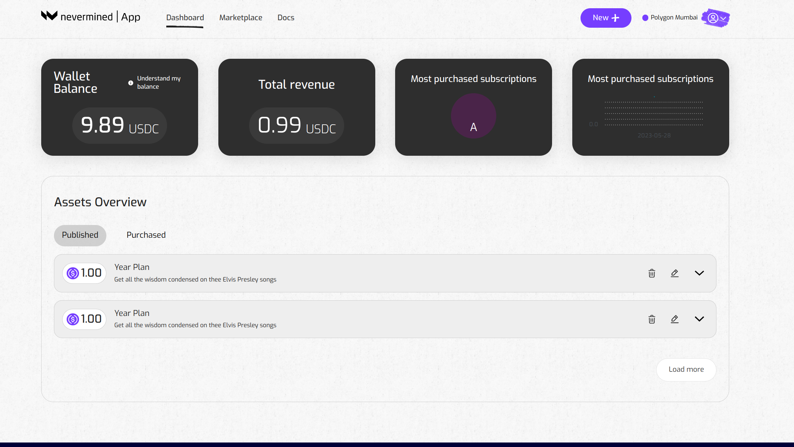

# How to create a Smart Subscription

Publishers can use Nevermined to create Smart Subscriptions. These function as access tokens and help AI or Data Publishers to control the access to their AI or Data Services.  

Creating a Smart Subscription is the first of two steps:

* First, you create a subscription. 
* Then, you register your asset (an AI web service, Data,...) and you link it to your subscription. This is explained in the [web service tutorial](05-register-webservice.md) and [data tutorial](06-register-dataset.md).

When you’ve completed those 2 steps, the Smart Subscription becomes an access control mechanism to your asset.

How does it work? 

Under the hood, a Smart Subscription is an NFT smart contract, created and owned by the Publisher. The users or subscribers can purchase a token giving them access to the services provided by the Publisher. 

## Before you start

The Smart Subscription will be deployed in a blockchain network. Currently, the Nevermined App is deployed on the Polygon and Gnosis networks (plus on their respective testnets). 

In order to interact with that network you need to:

1. Connect your MetaMask wallet to the relevant network (instructions [here](02-metamask.md)).
2. Get the right tokens to pay for the gas fees on that network (instructions [here](02-metamask.md))

## How to create a Smart Subscription

You can use the [Nevermined App](https://mumbai.nevermined.app/) to create a new subscription, as a way to protect the access to your digital asset. The steps to create a subscription are:

### 1. Open the New Asset page

- Click on the New button in the top right to go the New Asset page. 
- Then click 'Create Plan'

### 2. Fill in the Subscription metadata

Provide a description to explain to potential users what your Subscription is about. Some examples:

* Monthly pass to my OpenAI copilot
* 1-Year subscription to our Defi Data web service
* Free & forever access to my Discord server

Provide tags to make it easier to find in our Marketplace.

### 3. Configure the type of plan you want to create

We have pre-configured a few common options (Free and forever plan, one month subscription, one year subscription).
If you want to have more flexibility, clicking on the “Custom” button allows you to:

* specify the duration of the subscription
* specify the price (in USDC)

Click on “Next” when you’re happy with the configuration.

### 4. Review everything is okay

Before creating the subscription, you can review the description, duration and price. Click on “Create” if everything is okay or click on “Back” if you want to modify anything.

### 5. Register the subscription

The Nevermined App will register your new subscription on the blockchain. This will require you to sign 2 transactions in your MetaMask wallet. As explained in ‘Getting Ready’, this requires a little bit of tokens (depending on the network you're using) to pay for the network transaction fees.  

### 6. See the subscription you just published

Go to your dashboard to see the new subscription you created. Now, you can move on the next tutorial and associate your asset (a [Web Service](05-register-webservice.md), Dataset) to this subscription.

