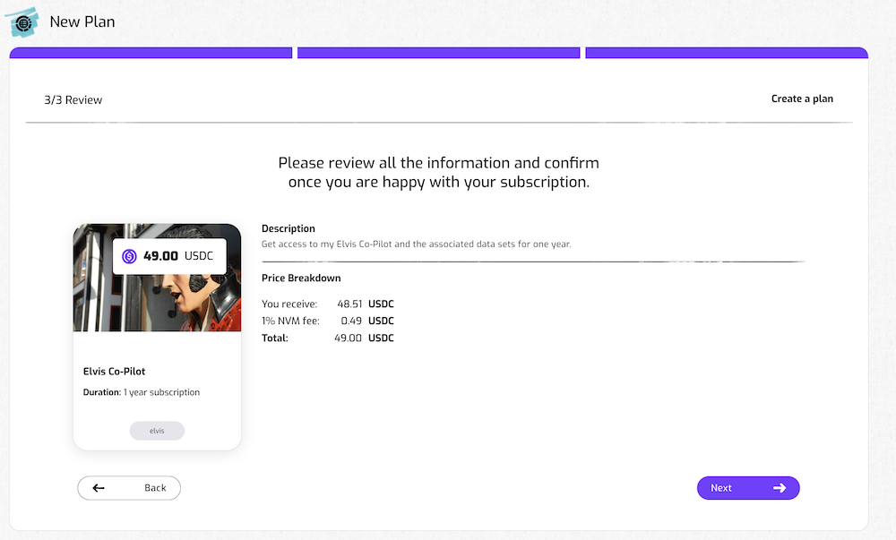

# How to create a Smart Subscription

Publishers can use Nevermined to create Smart Subscriptions. These function as access tokens and help AI or Data Publishers to control the access to their AI or Data Services.  

Creating a Smart Subscription is the first of two steps:

* First, you create a subscription. 
* Then, you register your asset (an AI web service, a Data set,...) and you link it to your subscription. This is explained in the [web service tutorial](05-register-webservice.md) and [data tutorial](06-register-dataset.md).

When you’ve completed those 2 steps, the Smart Subscription becomes an access control mechanism to your asset.

How does it work? 

Under the hood, a Smart Subscription is an NFT smart contract, created and owned by the Publisher. The users or subscribers can purchase a token that gives them access to the services provided by the Publisher. 

## Before you start

The Smart Subscription will be deployed in a blockchain network. Currently, the Nevermined App is deployed on the Polygon, Gnosis and Arbitrum networks (plus on their respective testnets). 

In order to interact with that network you need to get the right tokens to pay for the transaction fees on that network (instructions [here](02-metamask-tokens.md))

## How to create a Smart Subscription

You can use the [Nevermined Marketplace](https://nevermined.app/) to create a new subscription, as a way to protect the access to your digital asset. The steps to create a subscription are:

### 1. Connect your MetaMask to the Nevermined Marketplace

- Connect your MetaMask wallet to the network you want to use (instructions on adding networks [here](02-metamask-networks.md)).

#### The first time you connect
- The first time you connect, you will be asked to sign a message with your MetaMask wallet. This allows you to interact with the Nevermined marketplace. 

- You will be asked to create an account. This is optional, but it will help us keep you up-to-date.
- Agree to the Terms of Service to proceed. 

### 2. Open the New Asset page

- Click on the New button in the top right to go the New Asset page. 
- Then click 'Create Plan'

### 3. Add some metadata to your Subscription

#### Provide a description 
We recommend you to explain what your Subscription gives access to and for how long.
This can be long. You will add a (short) title in the next step.

Some examples:
* Monthly pass to our OpenAI copilot that summarizes 35 Elvis songs. 
* 1-Year subscription to our Defi Data web service, which indexes from 5 major DeFi platforms. 
* Free & forever access to my Discord server about best AI Coding practices. 

#### Add an image
You can add an image to highlight your Plan in the Marketplace. Pro tip: use your company's logo. 

#### Add tags
Tags can make it easier to find your Subscription in our Marketplace. Click '+' to add a tag. 

### 4. Set the Title, Duration and Price of your plan

#### Specify the duration of the subscription
We have pre-configured a few common options (Free plan, 1 month subscription, 1 year subscription).
If you want to have more flexibility, click on the “Custom” button. 

#### Give your Subscription a Title
Be short and specific.

#### Specify the price
How much do people have to pay (in USDC).

Click on “Next” when you’re happy with the configuration.

### 5. Review everything is okay

Before creating the subscription, you can review the description, duration and price. Click on “Create” if everything is okay or click on “Back” if you want to modify anything.

### 6. Register the subscription

The Nevermined App will register your new subscription on the blockchain. This will require you to sign 2 transactions in your MetaMask wallet. As explained in ‘Getting Ready’, this requires a small amount of tokens to pay for the network transaction fees.  

### 7. Add an asset to your Subscription

Now, you can move on the next step: append an asset to your Smart Subscription, either (a [Web Service](05-register-webservice.md) or a [Dataset](06-register-dataset.md).
Alternatively, you can go to your dashboard to see the new subscription you created. 

