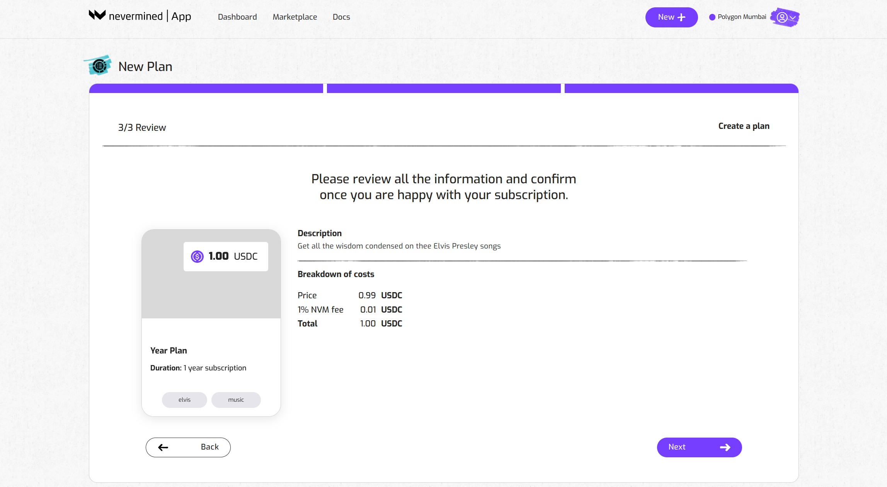

# How to create subscriptions

With Nevermined publishers can create subscription NFTs. These tokens function as access tokens and help AI or Data Publishers to control the access to their AI or Data Services This Facilitates peer-to-peer monetization between the publisher and the users. Someone who buys the subscription, aka a a user, gets a subscription they really own because it doesn't live in a company database. This subscription has become a liquid asset and can be traded or used in different ways.

Under the hood, this subscription is an NFT smart contract, created and owned by the Publisher. The users or subscribers can purchase (or get for free) a token giving  them access to the services provided by the Publisher. The revenue (if the subscription is not free) is distributed to the publisher of the subscription, with Nevermined charging a network fee of 1%.

Creating a subscription is the first of two steps:

* First, you create a subscription. 
* Then, you register your asset (an AI web service, Data,...) and you link it to your subscription. This is explained in this tutorial.

When you’ve completed those 2 steps,  the subscription NFT becomes an access control mechanism to your asset.

## Before you start

The subscription NFT contracts will be deployed in a blockchain network. Currently, the Nevermined App is connected to the Polygon Mumbai test network. In order to interact with that network you need to:

1. Connect your Metamask to Polygon Mumbai (instructions [here](02-metamask.md)).
2. Get some MATIC tokens to pay for the gas fees on that network. To do that you can get some free MATIC using the [Mumbai Faucet](50-faucets.md).

## How to create a subscription

You can use the [Nevermined App](https://mumbai.nevermined.app/) to create a new subscription, as a way to protect the access to your digital asset. The steps to create a subscription are:

### 1. Open the New Asset page

Click on the “Create Asset” button of the Subscription box

### 2. Fill in the Subscription metadata

Provide a description to explain to potential users what your Subscription is about. Some examples:

* Monthly pass to my OpenAI copilot
* 1-Year subscription to our Defi Data web service
* Free & forever access to my Discord server

Provide tags to make it easier to find in our Marketplace.

### 3. Configure the type of plan you want to create

We have pre-configured a few common options (Free and forever plan, one month subscription, one year subscription).
If you want to have more flexibility, clicking on the “Custom” button allows you to:

* specify the duration of the subscription
* specify the price (in USDC)

Click on “Next” when you’re happy with the configuration.

### 4. Review everything is okay

Before creating the subscription, you can review the description, duration and price. Click on “Create” if everything is okay or click on “Back” if you want to modify anything.

### 5. Register the subscription

The Nevermined App will register your new subscription on the blockchain. This will require you to sign 2 transactions in your MetaMask wallet. As explained in ‘Getting Ready’, this requires a little bit of MATIC to pay for the transaction fees. You can get some free MATIC using the Mumbai Faucet.

### 6. See the subscription you just published

Go to your dashboard to see the new subscription you created. Now, you can move on the next tutorial and associate your asset (a [Web Service](05-register-webservice.md), Dataset) to this subscription.

