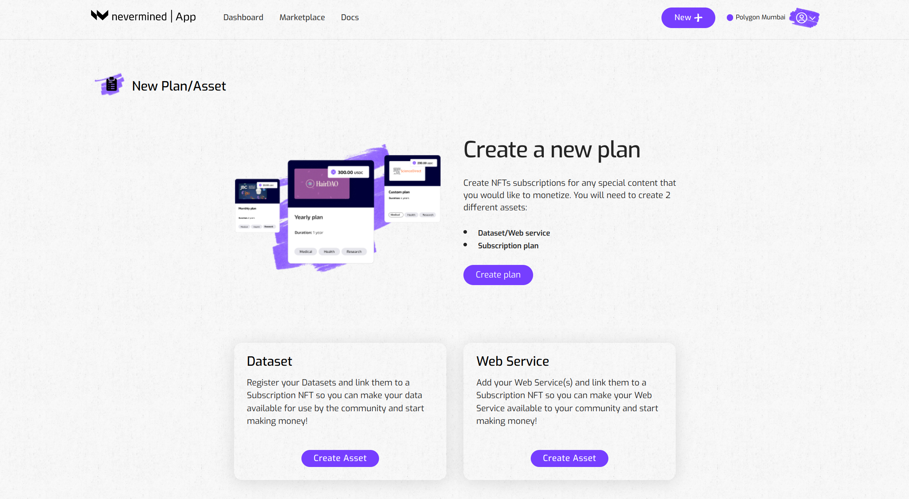
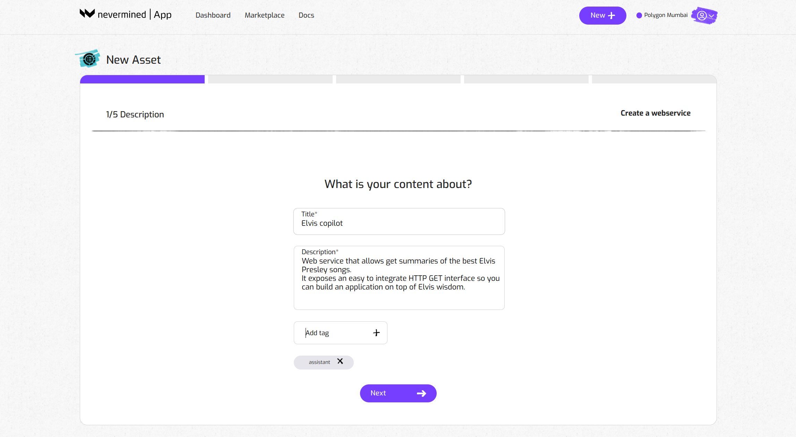

# How to register your web service

In Nevermined you can register a web service or a data set and make it “accessible” to users that hold a specific subscription NFT. In a previous tutorial we saw how to create a subscription. Here we show how to register a new asset and link it to a subscription.

Note: an asset can not be registered without having previously configured a subscription. Soo if you skipped that part, please go to the tutorial about [How to publish a subscription](04-create-subscription.md) first.

## Getting ready

Currently, the [Nevermined App](https://mumbai.nevermined.app/) is connected to the Polygon Mumbai test network. In order to interact with that network you need to:

1. Connect your Metamask to Polygon Mumbai (instructions [here](metamask.md)).
2. Get some MATIC tokens to pay for the gas fees on that network. To do that you can get some free MATIC using the Mumbai Faucet (more information [here](faucets.md)).
3. You should have created a subscription first. If you haven’t done that yet, go to [How to publish a subscription Tutorial](create-subscription.md) for instructions.

## How to register a web service

You can use the [Nevermined App](https://mumbai.nevermined.app/) to register a web service and make it accessible, only to users holding a specific subscription. The steps to register a web service are the following:

### 1. Open the New Asset page

### 2. Click on the “Create Asset” button of the Web Service box

   

### 3. Add the web service metadata

Provide a short title, description and tags to explain to potential users what your web service is about. Some examples:

- _Summarize any document you have_
- _My OpenAI assistant_
- _World weather forecast service_

  

### 4. Configure the attributes of the web service
   
First you add all the server links we want to expose and protect (i.e: <https://myapi.example.com/v1>). Paste the link and click on the **“+”** button
Note that you can use this URL field  to specify regular expressions. This could be useful when you want to expose multiple links at once. For example: <https://myapi.example.com/(.*)> will expose all the endpoints under the same domain.

### 5. Add the access token

Next, you can add an optional access token to your web service. Nevermined can protect the access to a web service that uses a HTTP Bearer token for authorization. Your access token is encrypted and always will be kept private.

### 6. Upload a cover image

This is optional but recommended. Providing cover images make more attractive your web service on the marketplace.

### 7. Upload a Terms and Conditions document

The T&C document defines any rules related to the usage of your web service. This is optional, but recommended. Click on the “Next” button when you are done.

### 8. Attach a subscription

Now the web service is configured, you need to specify what type of subscription a user requires to get access to your web service. You can link your web service to one or multiple subscriptions.
  

### 9. Review everything is okay

Finally, review your web service subscription. Click on “Create” if everything is okay or click on “Back” if you want to modify anything.
  

### 10. Web service registration 

The Nevermined App will register the new web service on the blockchain. This will require you to sign one transaction in your MetaMask wallet. As explained in ‘Getting Ready’, this requires a little bit of MATIC to pay for the transaction fees. You can get some free MATIC using the [Mumbai Faucet](https://mumbaifaucet.com/).
  

### 11. Registration confirmation

You’re done! Go to your dashboard to see your subscription tiers and the web services associated with it.
   

Click on the web services to see more detailed information, including the on-chain provenance info and a Buy Now section. You can share this link with anyone interested in buying a subscription to your web service.  
  
