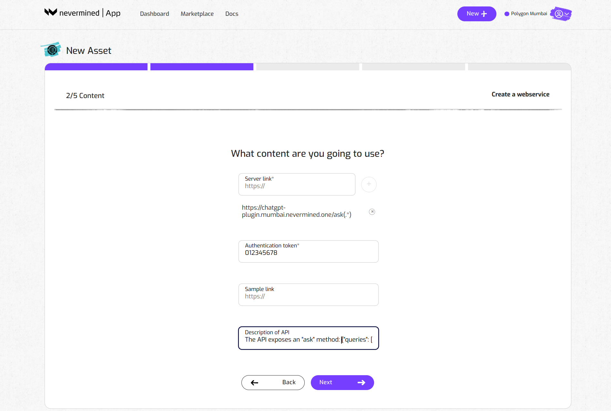
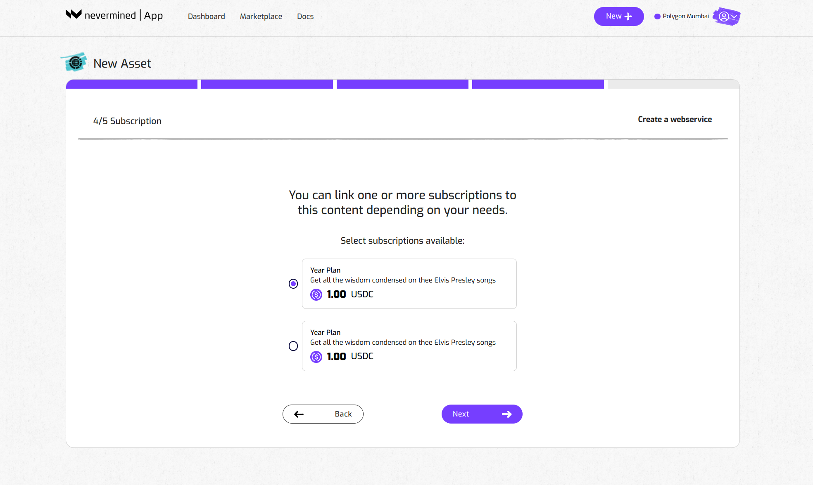
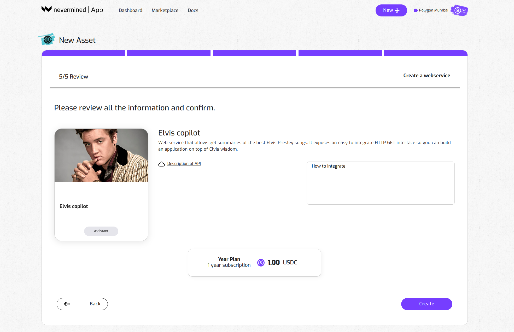

# How to register your AI web service and link to a Smart Subscription

In a previous tutorial we showed how to create a Smart Subscription. Here we go through the required steps of registering a new AI web service and link it to your Smart Subscription. Owners who purchase that subscription will get access to the AI web service that is included in the plan. 

:::note
You can't register an asset without first configuring a Smart Subscription. So if you skipped that part, please go to the tutorial about [How to create a Smart Subscription](04-create-subscription.md) first.
:::

## Before you start

Currently, the Nevermined App is deployed on the Polygon, Gnosis and Arbitrum networks (plus on their respective testnets). 

In order to interact with that network you need to:

1. Connect your MetaMask wallet to the relevant network (instructions [here](02-metamask-networks.md)).
2. Get the right tokens to pay for the gas fees on that network (instructions [here](02-metamask-tokens.md))

## How to register an AI web service

These are the steps to make your web service accessible to holders of your Smart Subscription.

### 1. Open the New Asset page

- Click on the New button in the top right to go the New Asset page.
- Click on the “Create Asset” button of the Web Service box.

### 2. Add the web service metadata

Provide a short title. 

Use the description box to explain to potential users what your web service is about. Some examples:
- _An open source summarizer specialised in scientific research_
- _A chatbot-style AI Agent that generates quotes based on Elvis lyrics. Built using Lllama Index and an open source LLM. Good for devs who want to have some fun, build a Discord bot,..._

Add tags to help buyers find your AI Web Service in the Nevermined marketplace. 
Click the + symbol to add new tags. 

### 3. Configure the attributes of the web service

In the next page, you add all the endpoint APIs of your AI agent or model (e.g. <https://myapi.example.com/v1>). 
Paste the link and click on the **“+”** button

Note that you can use this URL field to specify regular expressions. This can be useful when you want to expose multiple links at once. For example: 
<https://myapi.example.com/(.*)> will expose all the endpoints under the same domain.

### 4. Add the access token

Next, you add an access token to your web service. Nevermined can protect the access to a web service that uses a HTTP Bearer token for authorization. Your access token is encrypted and will always be kept private.

### 5. Add a sample link

Give your potential buyers an idea of what they can expect. Add a test link showing what your AI is about.

### 6. More information about your web service

Add any information for developers about how to integrate your web service. 

You can also add an image to add a visual description of the web service you're making available. 

### 7. Choose a subscription plan 

Next, you need to specify what type of subscription a user requires to get access to your web service. 

:::Pro tip
If you want your web service to be available via different plans, you can go through this process once more. 
Register the asset again and add it to another Smart Subscription plan. For now ;-)
:::

### 8. Review everything is okay

Finally, review your web service subscription. 
Click on “Create” if everything looks good. Or go “Back” if you want to modify anything.

### 9. Web service registration

The Nevermined App will register the new web service on the blockchain. This will require you to sign one transaction in your MetaMask wallet. As explained in ‘Getting Ready’, this requires a little bit of gas tokens to pay for the transaction fees. 

---

### 10. Distribute and make some money

You’re done! 
Go to your dashboard to get an overview of your Smart Subscription(s) and the web service(s) associated with it.

 

Click on the web service to go the Asset Detail page. 

Share this URL with potential buyers. They can use the 'Buy Now' button to purchase directly from you. 
In addition, people can also automatically discover your AI web service in the Nevermined Marketplace.  

