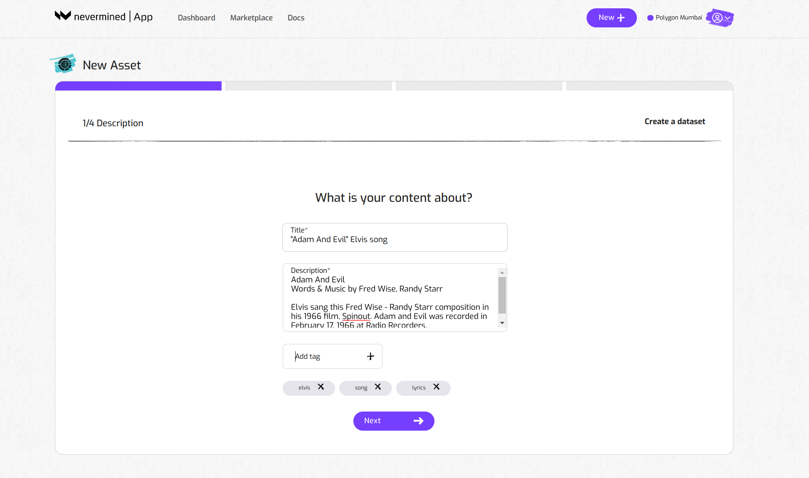
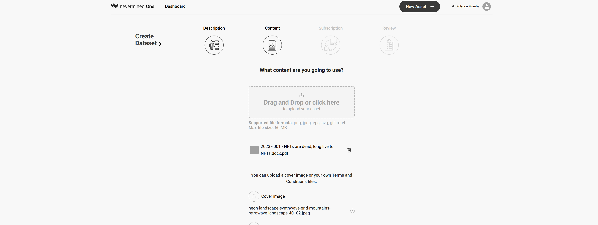
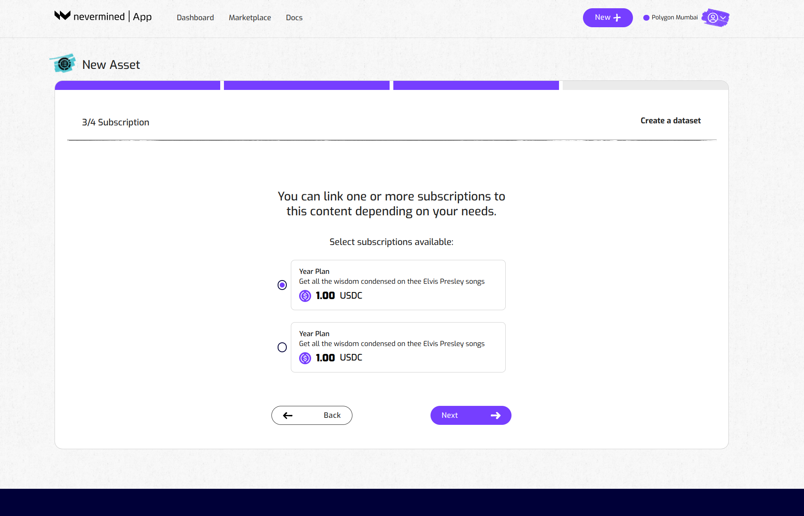
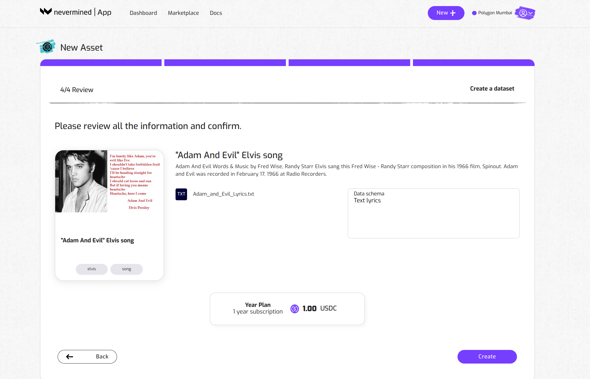
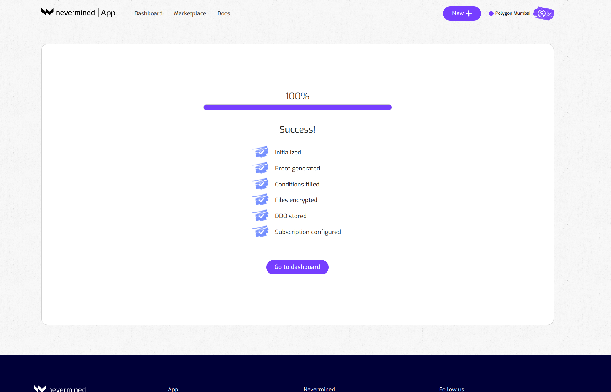
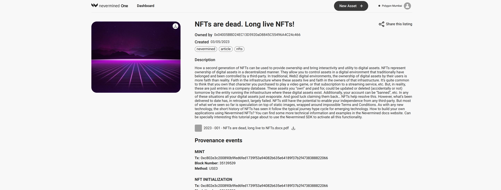

# How to register your dataset and link to a Smart Subscription

In a previous tutorial we showed how to create a Smart Subscription. Here we go through the required steps of registering a new datazet and link it to your Smart Subscription. Owners who purchase that subscription will get access to the one or more datasets that are included in the plan. 

:::note
You can't register an asset without first configuring a Smart Subscription. So if you skipped that part, please go to the tutorial about [How to create a Smart Subscription](04-create-subscription.md) first.
:::

## Getting ready

Currently, the Nevermined App is deployed on the Polygon, Gnosis and Arbitrum networks (plus on their respective testnets). 

In order to interact with that network you need to:

1. Connect your MetaMask wallet to the relevant network (instructions [here](02-metamask-networks.md)).
2. Get the right tokens to pay for the gas fees on that network (instructions [here](02-metamask-tokens.md))

## How to register a dataset

These are the steps to make your dataset available to holders of your Smart Subscription.

### 1. Open the New Asset page

- Click on the New button in the top right to go the New Asset page.
- Click on the “Create Asset” button of the Dataset box.

### 2. Provide a short title and other metadata

Provide a description to explain to potential purchasers what your dataset is about. 
Example: 
- Aggregate dataset about hair loss research. Done by Dr. Whig. Conducted in 2021, with 3500 Spanish males. 
or
- A CSV file containing the lyrics of these 43 Elvis songs: Love Me Tender, Jailhouse Rock,...

Add tags to help buyers find your AI Web Service in the Nevermined marketplace. 
Click the + symbol to add new tags. 

### 3. Upload the files and supporting assets

Drag & drop or browse in your local computer to upload your dataset. 
Note: a dataset can have multiple files associated to it. 
Any file format is permitted. 

We also recommend adding information about the Data Schema. Describe the structure of your dataset: fields, field types, number records, etc

Give your potential buyers an idea of what they can expect, by uploading a sample set of your data.

Finally, you have the option to add a visual that gives more info about your Data Asset, e.g. an image of Elvis. 

### 4. Choose a subscription plan 

Next, you need to specify what type of subscription a user requires to get access to your dataset. 

:::Pro tip
If you want your data set to be available via different plans, you can go through this process once more. 
Register the asset again and add it to another Smart Subscription plan. For now ;-)
:::

### 5. Review everything is okay

Finally, review your data subscription. 
Click on “Create” if everything looks good. Or go “Back” if you want to modify anything.

### 6. Dataset registration

The Nevermined App will register the new data set on the blockchain. This will require you to sign two transactions in your MetaMask wallet. As explained in ‘Getting Ready’, this requires a little bit of gas tokens to pay for the network transaction fees. 

---

### 7. Distribute and make some money

Go to your Dashboard to get an overview of your Smart Subscription(s) and the data set(s) associated with it.

Click on the eye-icon of your data set to go the Asset Detail page. 

Share this URL with potential buyers. They can use the 'Buy Now' button to purchase directly from you. 
In addition, people can also automatically discover your Data Asset in the Nevermined Marketplace.  

