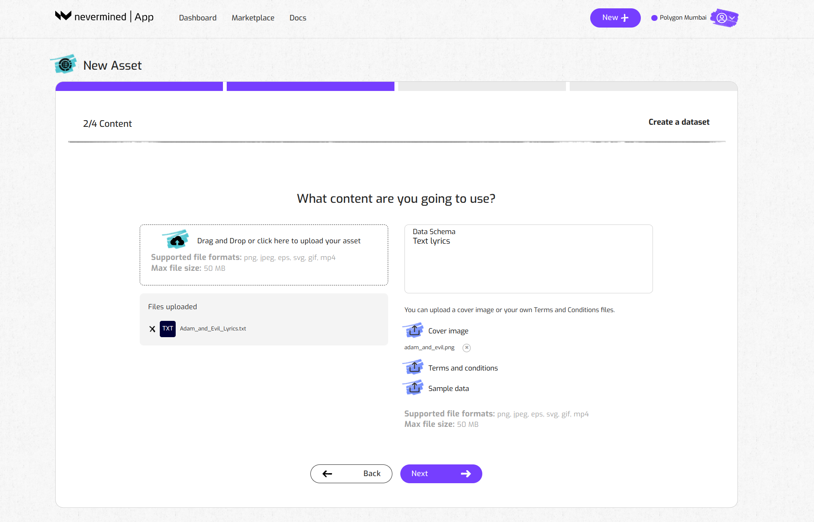
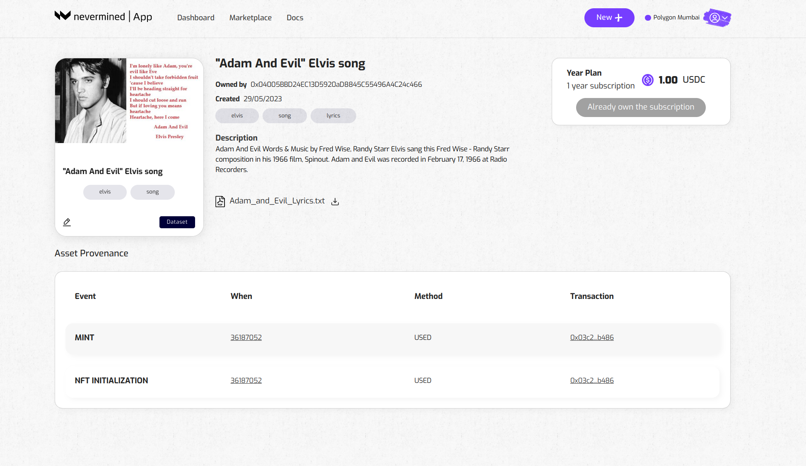

# How to register your dataset

You can also use the [Nevermined App](https://mumbai.nevermined.app/) to register a new dataset. This means that the data associated with this asset  will only be accessible to users that holding a specific subscription.

:::note
An asset can not be registered without having previously configured a subscription. Soo if you skipped that part, please go to the tutorial about [How to publish a subscription](04-create-subscription.md) first.
:::

## Getting ready

Currently, the [Nevermined App](https://mumbai.nevermined.app/) is connected to the Polygon Mumbai test network. In order to interact with that network you need to:

1. Connect your Metamask to Polygon Mumbai (instructions [here](02-metamask.md)).
2. Get some MATIC tokens to pay for the gas fees on that network. To do that you can get some free MATIC using the Mumbai Faucet (more information [here](50-faucets.md)).
3. You should have created a subscription first. If you haven’t done that yet, go to [How to publish a subscription Tutorial](04-create-subscription.md) for instructions.

## How to register a dataset

The steps to register a dataset are the following:

### 1. Open the New Asset page

Click on the “Create Asset” button of the Dataset box

### 2. Provide a short title

Provide a description to explain to potential users what your data set is about. Optionally you can add some tags too. They make easier to discover the asset in the marketplace.

### 3. Upload the files

A dataset could have multiple files associated to it. Here you can drag & drop or browse in your local computer to upload this data

### 4. Upload a cover image

This is optional but makes simpler for users to identify the asset in the marketplace.

### 5. Upload and a Terms and Conditions

Term and Conditions document to define any rules related to the usage of your web service. This is optional, but recommended.

### 6. Attach a subscription

Now your data set is configured and you need to  specify the subscription a user requires to get access to the files associated with the asset.

### 7. Review everything is okay

Review all the info provided about your dataset. Click on “Create” if everything is okay or click on “Back” if you want to modify anything.

### 8. Dataset registration

TheNevermined App will register your dataset. This will require you to sign 2 transactions in your MetaMask wallet. 
As explained in ‘Getting Ready’, this requires a little bit of MATIC to pay for the transaction fees. You can get some free test MATIC using the [Mumbai Faucet](https://mumbaifaucet.com).

---

Done! Go to your dashboard to see the subscription(s) you created and the associated dataset.

Users can discover the asset in the marketplace and purchase the subscription to your dataset from the Asset detail page. People can find this via theMarketplace or you can share the URL directly.and can be accessed and purchased by the rest of the users:

