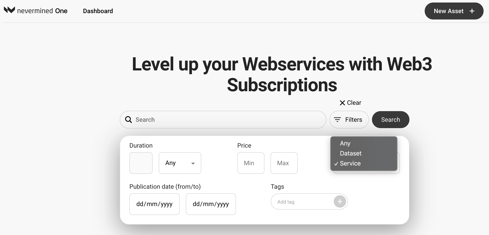
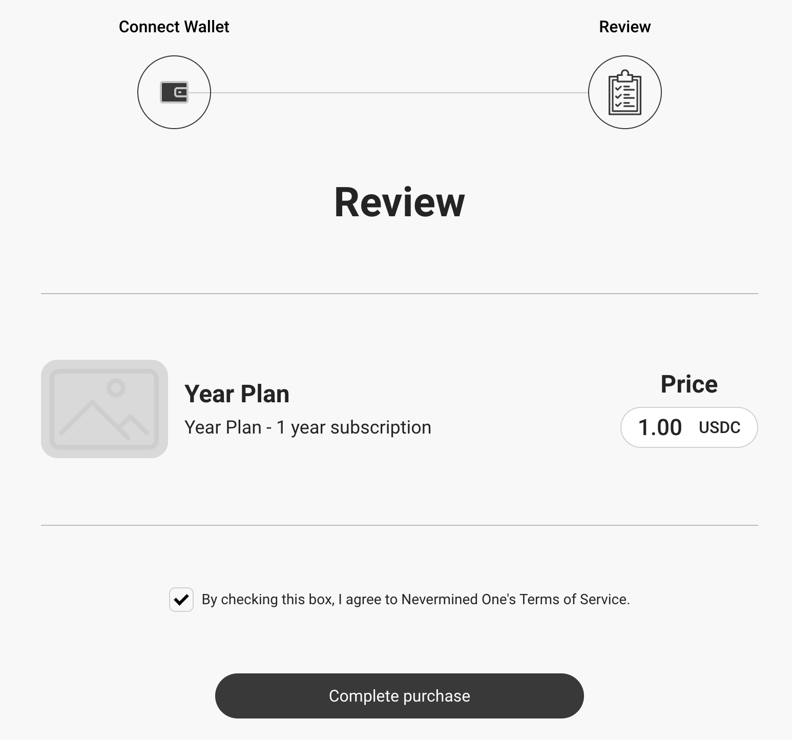
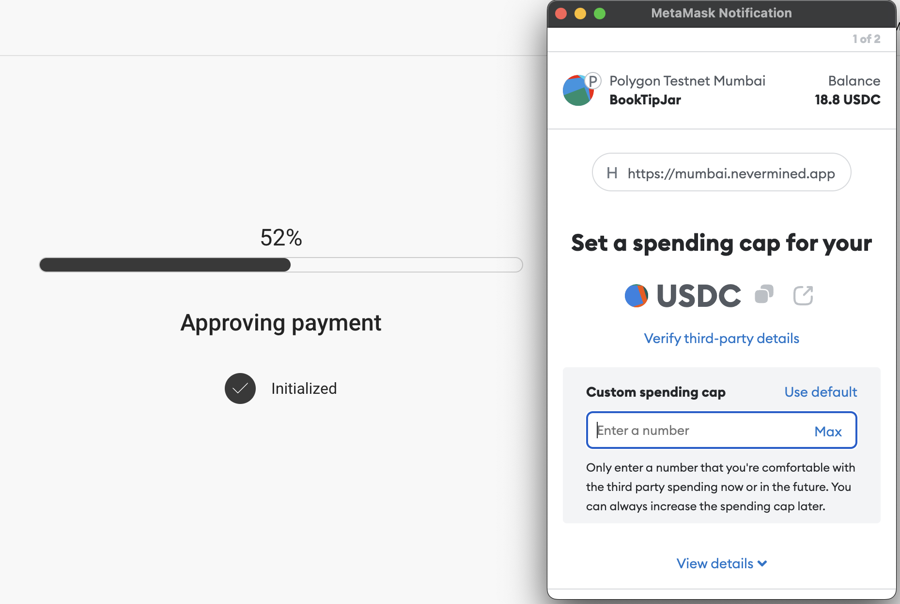
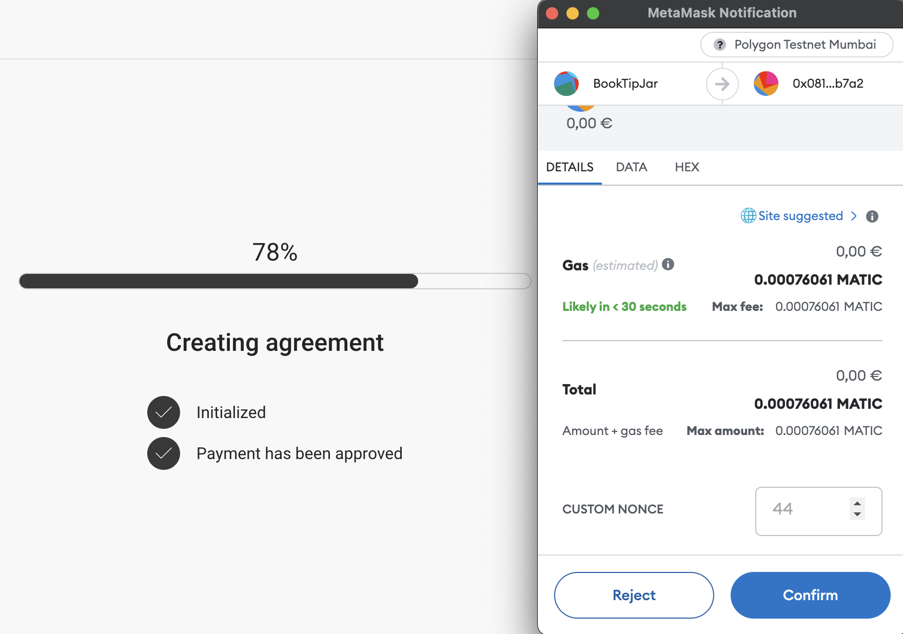
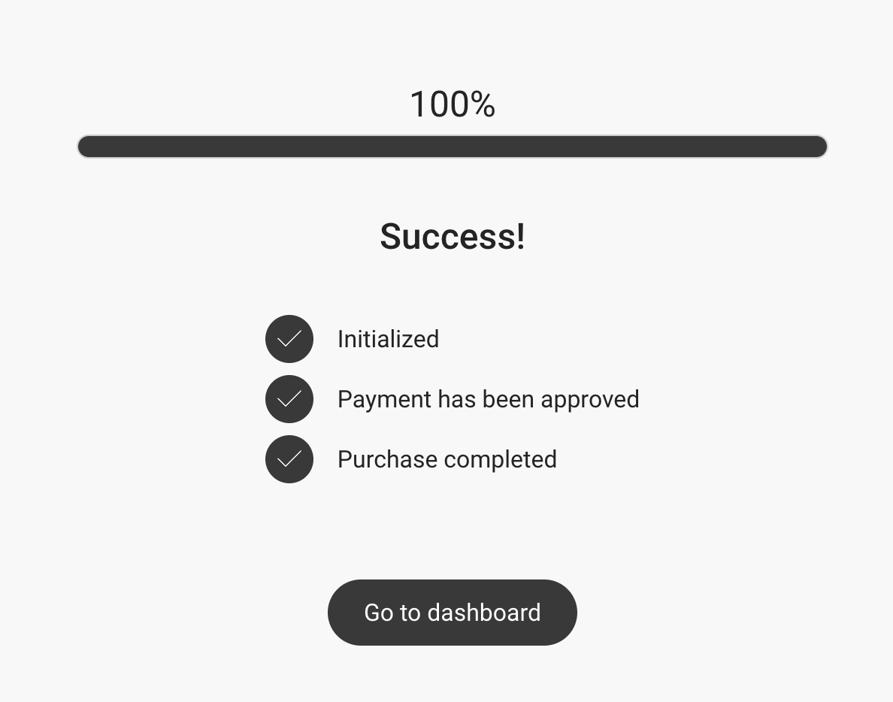

# Searching assets and buying subscriptions

The Nevermined marketplace allows you to browse, search and purchase access to any of the assets that have been registered. 

## Before you start
Currently, the Nevermined App is connected to the Polygon Mumbai test network. In order to interact with that network you need to:

1. Connect your Metamask wallet to Polygon Mumbai (instructions [here](02-metamask.md)).
2. Get some MATIC tokens to pay for the gas fees on that network. To do that you can get some free MATIC using the [Mumbai Faucet](10-faucets.md).
3. You will need (test) USDC to pay for the subscription. Again, there's [a faucet](10-faucets.md) for that. 

## How to buy a subscription for the asset you want

Once you are connected to the Nevermined app (with your Metamask wallet), you can use the Marketplace to find and purchase the asset you're interested in. 
Go to the marketplace via Home or by clicking Marketplace in the footer. 

### 1. Find the asset you're interested in

The marketplace has different ways to find assets.
* Use the search field to type in keywords related to the title of the asset
* Use the filter function to restrict your search to certain assets types, subscription durations, tags,...

### 2. Read detailed information

Clicking on 'Learn More' will give you an overview page of the asset, including: 
* the description provided by the publisher
* some on-chain meta-data
* the price and duration of the subscription you can purchase

If this is the asset you want, simply click the Buy button. 

### 3. Review and confirm

Check the box to confirm you agree with the Nevermined T&C and click 'Complete Purchase'. 

### 4. Sign the transactions

First, it is possible that your Metamask wallet asks you to approve a spending cap for USDC.  

After that, you have to confirm your purchasee (and the small gas fee).  

After a short wait you will see a confirmation message. Click on 'Dashboard' to manage the asset you've now bought access to. 

