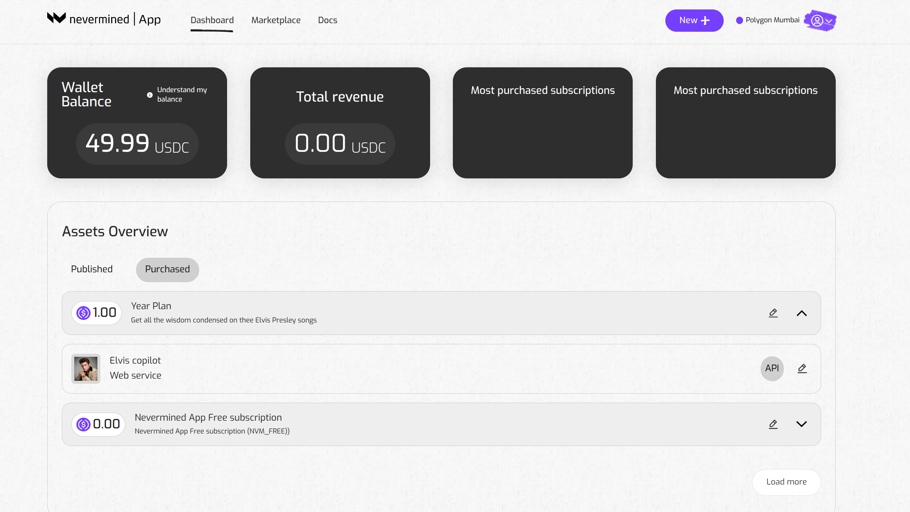
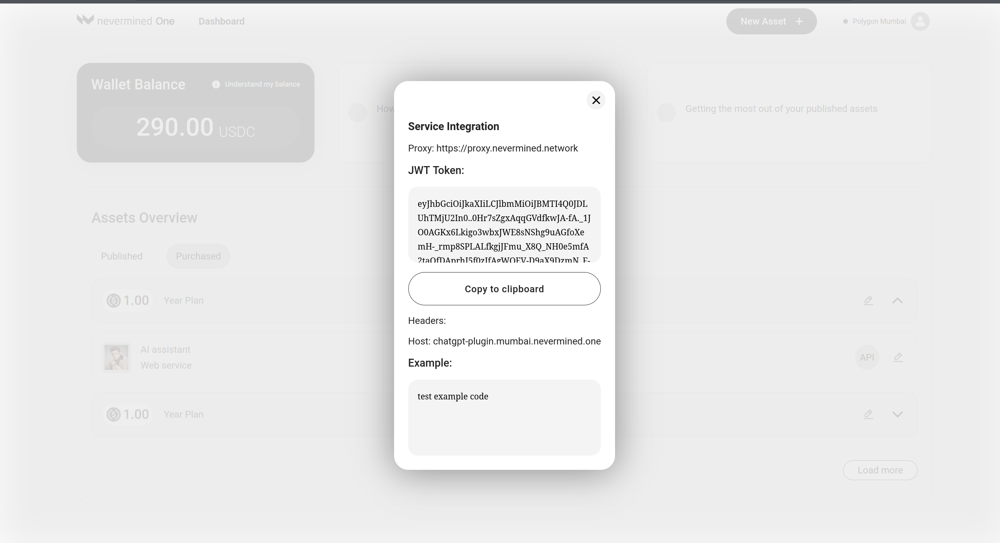

# How to integrate a web service in an application

In this tutorial we show how a user who bought a subscription to a web service, can integrate that web service in an application.

## Getting ready

If you got this far, we assume you know that: 
1. You need to connect your Metamask to Polygon Mumbai (instructions [here](02-metamask.md)).
2. You need some MATIC tokens to pay for the gas fees on that network. To do that you can get some free MATIC using the Mumbai Faucet (more information [here](10-faucets.md)).
3. You also need to own a Subscription NFT for the web service you want to integrate. If you haven't done that yet, first purchase a subscription. [tutorial here](07-search-and-purchase.md)

## How to integrate a web service

The steps to integrate are the following:

### 1. Open your Dashboard page

Click on the “Dashboard” link on the header of the application. Click on the "Purchased" link to display the subscriptions you own.



### 2. Get the JWT access token

Click on the arrow to list all the assets (datasets and webservices) that are part of the subscription.

Each web services will show an **"API"** button at the right hand side. If you click on it, the application will require you to sign a message (no gas fees). After that, you will see the web service's JWT access token.



The JWT token is the access key identifying you as a subscriber. It allows you to make HTTP requests to the web service. Once you have it, you can make requests to all the endpoints that are included in the web service that you subscribed to.

Copy both the JWT token and the Proxy url (https://proxy.nevermined.network/). You need these to enable your app to send HTTP requests.

### 3. Use the JWT to call the service

Next we will show how you can integrate the web service into your app using Command Line. 

#### 3.a Using curl to integrate the web service

Here we are gonna use **curl** but the same works for any HTTP client application or library.

```bash
# Here we export the JWT token pasted from the NVM App
export $JWT_TOKEN=””

# In our example we are sending a body message via HTTP POST. 
# For sake of clarity, here we export the message we are gonna send to the web service
export REQUEST_DATA='{"queries": [{"query": "Adam And Evil", "filter": {}, "top_k": 1 }]}'

# With curl we make a POST request and we add the $JWT_TOKEN as Bearer token in the Authorization header
# The url where we send the request is the host name of the proxy: "https://proxy.nevermined.network" plus the endpoint of the service 
# we are calling, int this case "/ask"
curl -k -X POST -H "Content-Type: application/json"  -H "Authorization: Bearer $JWT_TOKEN" -d "$REQUEST_DATA" https://proxy.nevermined.network/ask

{"response":"\nThe song is about a person who is in love with someone who is not perfect, but they cannot live without them. Despite knowing that loving this person will bring heartache, they are willing to take the risk and accept the consequences. The song also compares the relationship to the story of Adam and Eve, with the person in the song being like Adam and their love interest being like Eve.","source_nodes":[{"node":{"text":"...","doc_id":"8e748293-f8d2-41b8-a225-7479455b1899","embedding":null,"doc_hash":"451d68b33de1e8034e48c6a98865364e52edd02837f06c34c662ba6d6d462c76","extra_info":null,"node_info":{"start":0,"end":1030},"relationships":{"1":"did:nv:3e0a13a6dba0ab20e83bf25c3e820af8b71c94cea0ab0763b4f822a6998009e6"}},"score":0.7585169416635178}],"extra_info":null}
```


#### 3.b Using typescript to integrate the web service

```typescript
const proxyEndpoint = `https://proxy.nevermined.network/ask`
const requestData = '{"queries": [{"query": "Adam And Evil", "filter": {}, "top_k": 1 }]}'

opts.headers = {
    // The proxy expects the `HTTP Authorization` header with the JWT
    authorization: `Bearer ${JWT_TOKEN}`,
    'content-type': 'application/json'
}

opts.method = 'POST'
opts.body = requestData

const result = await fetch(proxyEndpoint, opts)

assert.isTrue(result.ok)
assert.equal(result.status, 200)
```
