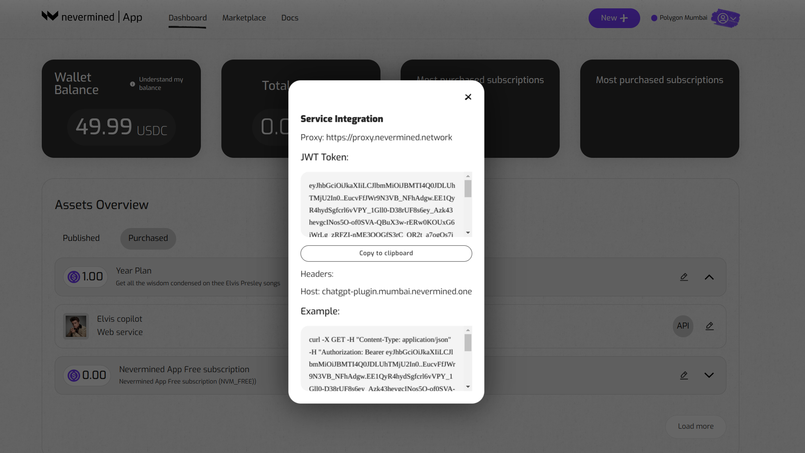

# How a subscriber can integrate a web service

In Nevermined you can find web services published by some other users. These web services are published in such a way any user can [purchase a subscription](07-search-and-purchase.md) and get access to them.

In this tutorial we are gonna see how a user who already owns a subscription giving access to a web service, can integrate that web service in an application.

## Getting ready

Currently, the [Nevermined App](https://mumbai.nevermined.app/) is connected to the Polygon Mumbai test network. In order to interact with that network you need to:

1. Connect your Metamask to Polygon Mumbai (instructions [here](02-metamask.md)).
2. Get some MATIC tokens to pay for the gas fees on that network. To do that you can get some free MATIC using the Mumbai Faucet (more information [here](10-faucets.md)).
3. You should have own a subscription with a web service attached to it. If you don't please read the Tutorial [How to search and purchase assets](07-search-and-purchase.md) first.

## How to integrate a web service

The steps to integrate are the following:

### 1. Open your Dashboard page

Click on the “Dashboard” link on the header of the application. Click on the "Purchased" link to display the subscriptions you purchased and already own.


### 2. Get the JWT access token

Now you can see all the subscriptions you own, if you click in the arrow you will expand the view listing all the assets (datasets and webservices) included as part of the subscription.

All the web services included as part of the subscription are identified with the type "Web service" and will show an **"API"** button at right. If you click on it, the application will require you to sign a message and will show the web service JWT access token.



### 3. Copy the JWT token

The JWT token is the access key identifying you as a subscriber and allows you to make HTTP requests to the web service. Once you have it, using it you can make requests to all the endpoints included as part of the web service.

Copy the JWT token and the Proxy url (https://proxy.nevermined.network/) from the screen, we are gonna use them to send a HTTP request.

### 4. Use the JWT to call the service

Having the JWT and the Proxy url We are gonna test everything works in the command line. 

#### 4.a Using curl to integrate the web service

Here we are gonna use **curl** but the same works for any HTTP client application or library.

```bash
# Here we export the JWT token pasted from the NVM App
export $JWT_TOKEN=””

# In our example we are sending a body message via HTTP POST. 
# For sake of clarity, here we export the message we are gonna send to the web service
export REQUEST_DATA='{"queries": [{"query": "Adam And Evil", "filter": {}, "top_k": 1 }]}'

# With curl we make a POST request and we add the $JWT_TOKEN as Bearer token in the Authorization header
# The url where we send the request is the host name of the proxy: "https://proxy.nevermined.network" plus the endpoint of the service 
# we are calling, int this case "/ask"
curl -k -X POST -H "Content-Type: application/json"  -H "Authorization: Bearer $JWT_TOKEN" -d "$REQUEST_DATA" https://proxy.nevermined.network/ask

{"response":"\nThe song is about a person who is in love with someone who is not perfect, but they cannot live without them. Despite knowing that loving this person will bring heartache, they are willing to take the risk and accept the consequences. The song also compares the relationship to the story of Adam and Eve, with the person in the song being like Adam and their love interest being like Eve.","source_nodes":[{"node":{"text":"...","doc_id":"8e748293-f8d2-41b8-a225-7479455b1899","embedding":null,"doc_hash":"451d68b33de1e8034e48c6a98865364e52edd02837f06c34c662ba6d6d462c76","extra_info":null,"node_info":{"start":0,"end":1030},"relationships":{"1":"did:nv:3e0a13a6dba0ab20e83bf25c3e820af8b71c94cea0ab0763b4f822a6998009e6"}},"score":0.7585169416635178}],"extra_info":null}
```


#### 4.b Using typescript to integrate the web service

```typescript
const proxyEndpoint = `https://proxy.nevermined.network/ask`
const requestData = '{"queries": [{"query": "Adam And Evil", "filter": {}, "top_k": 1 }]}'

opts.headers = {
    // The proxy expects the `HTTP Authorization` header with the JWT
    authorization: `Bearer ${JWT_TOKEN}`,
    'content-type': 'application/json'
}

opts.method = 'POST'
opts.body = requestData

const result = await fetch(proxyEndpoint, opts)

assert.isTrue(result.ok)
assert.equal(result.status, 200)
```
