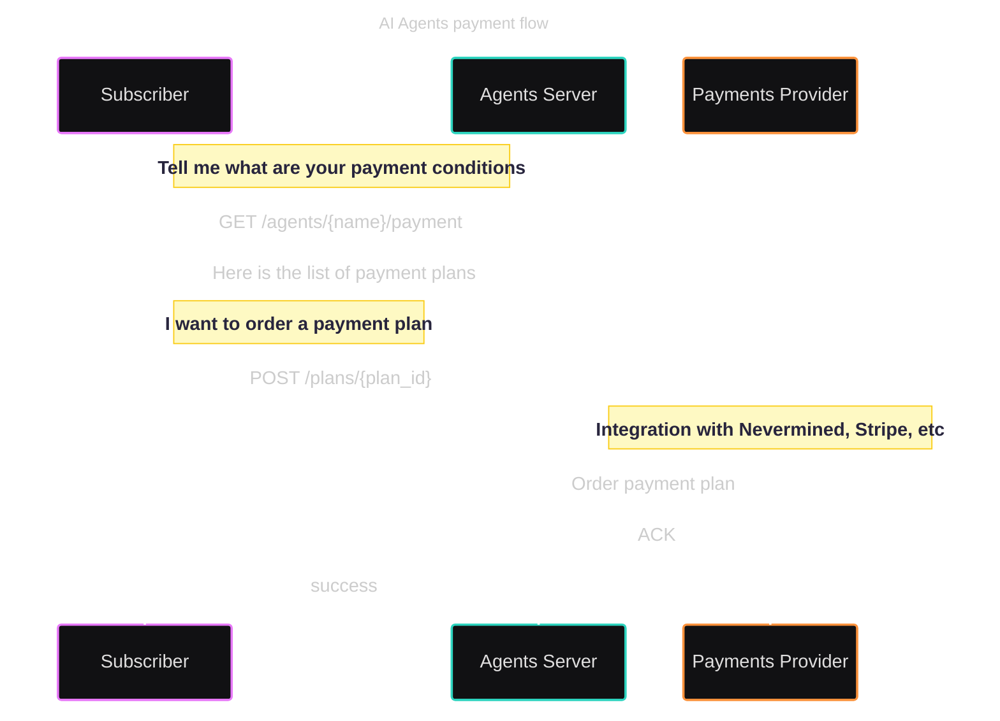
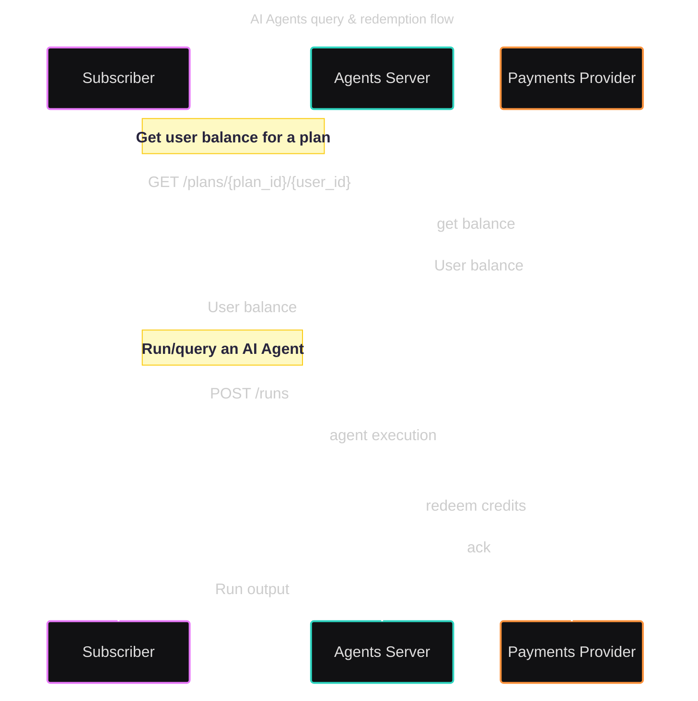

# Proposal for a Payments module in ACP

## Abstract

The current version of ACP assumes communication between users and agents without access control or
users paying for the agents' services (LLMs and infrastructure used by agents have a
cost). It's logical to think that part of the natural evolution of regular agents & multi-agent
systems will be the creation of economies where humans (or other agents) pay for access to other
agents.

## Motivation

The motivation for this proposal is to create a payments module that allows agents to charge for
their services. This module needs to support payments for human-to-agent and agent-to-agent
interactions.

The existence of a common specification for payments will allow different technologies implementing
this to provide this functionality.

### Core Features

The core functionalities included in this proposal are:

- **Agent monetization**: AI Builders should have the flexibility to define the price and the
  conditions to access their APIs. Subscribers (human or other agents) should be able to pay for
  access to the agent APIs.
- **Access control**: Access to Agent APIs can be restricted, so only subscribers with a valid
  subscription can access the Agent API.
- **Accounting & Metering**: The usage of the agents can be tracked, and that information can be
  used as part of the access control mechanism. For example, you pay $10 to make 100 requests to the
  agent API.

These three features are the core of the payments module and complement each other. Agent monetization
implies that when a user purchases access to an agent API, the ability of the subscriber to access
the agent is registered/accounted for. That accounting is necessary to restrict or permit the
access of subscribers to the agent API. A fully functional payments module will require the
combination of these three features.

## Payments Module: Specification Proposal

### Get the information about how an agent can be paid

As part of the existing `GET /agents/{name}` or as an additional endpoint.

```http
GET /agents/{name}
[OR]
GET /agents/{name}/payment
```

It returns the payment information of the agent by ID (agent name). An AI Agent can offer different
payment options configured as payment plans. This endpoint returns all the options available so
subscribers (humans or other agents) can decide what is the most convenient method to purchase the
plan and subscribe. Users subscribing to a payment plan can access the Agents associated with it.
This function is designed to be integrated into user interfaces or by other AI Agents, who can parse
this information to order the plan required to access an agent. Returns the payment information. The
response will include information about all the plans associated with the agent.

### Order a payment plan

```http
POST /plans/{plan_id}
```

Orders a payment plan required to access an AI Agent. When a plan is purchased by a user, all the
agents associated with the plan can be queried by the user having that subscription. Returns the
status of the purchase order.

### Get plan balance

```http
GET /plans/{plan_id}/{user_id}
```

Gets the balance information of a user for a specific plan. It returns the balance information for a
user identified by a "user_id" for a plan identified by the "plan_id". Typically, a user needs to
"order" a plan to get some balance. The balance represents the number of "credits" that user owns.

### Redeem credits

```http
PUT /plans/{plan_id}/redeem
```

Method used to redeem plan credits. This typically happens when an agent is queried by a user. When
a subscriber (owning a specific plan) calls an agent, depending on the usage, some credits can be
redeemed. This method allows redeeming these credits and updating the balance of credits of the user
for a specific plan.

## User Flows

### Subscriber asks for payment conditions

When a user/subscriber (human or other agent) wants to know how to pay for an agent, they can call the
`GET /agents/{name}/payment` endpoint. This endpoint returns the payment information with the
payment plans available.

With that information, the user can decide which plan to order and call the `POST /plans/{plan_id}`
endpoint to order the plan. The Agents Server (via the Payments Provider) will process the payment
and return the status of the purchase order.



### Subscriber checks the plan balance and executes a query into an Agent

When a subscriber (who already ordered a plan) wants to run an AI Agent, they can check the balance of
any of the payment plans granting access to the agent. The balance is checked by calling the
`GET /plans/{plan_id}/{user_id}` endpoint. This endpoint returns the balance information for a user
identified by a "user_id" for a plan identified by the "plan_id".

If the user has enough balance, they can call the `POST /runs` endpoint to run the agent. The Agents
Server will execute the AI Agent and redeem the credits used for that execution. The balance of the
user is updated accordingly.



## Open API

You can find the Open API specification for the Payments module at the following link:
[ACP Payments :: OpenAPI definition](acp_payments_openapi.yaml). See the OpenAPI payments module
online here:
